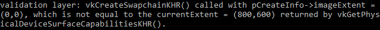

# 呈现

## 窗口表面

由于Vulkan 是一个平台无关的API，它本身并没有提供与窗口直接交互的接口，为了建立窗口与Vulkan的连接以将最终的渲染结果呈现到屏幕上,我们需要使用WSI扩展(窗口集成系统),在本章，首先要讨论的是 VK_KHR_surface. 它对外暴露了一个 VkSurfaceKHR 的对象,其代表的是一个呈现渲染结果的抽象概念，在我们的程序中，这个表面的后端是通过GLFW打开的窗口。

这个 VK_KHR_surface 是一个实例级的扩展，实际上我们已经启用它了，因为它的名字被包含在 glfwGetRequiredInstanceExtensions 返回的列表中.这个列表还包含了其他的WSI扩展，我们会在稍后使用到。

窗口表面需要在实例创建之后被创建出来，因为它可以影响到物理设备的选择，我们推迟到现在才介绍这个主题，是因为渲染目标和呈现渲染结果是一个庞大的主题，会让之前的基础安装章节显得过于杂乱。也应当注意到,窗口表面对 Vulkan来说是一个完全可选的组件,如果你仅需要离屏渲染的功能，Vukan就不必像OpenGL那样再创建一个不可见的窗口了。

### 窗口表面的创建

首先在调试对象回调的下面新增一个 surface 成员类

```c++
VkSurfaceKHR surface;
```

尽管 VkSurfaceKHR 对象它的使用是平台无关的，但是它的创建却不是这样的，因为创建时需要依赖操作系统窗口的许多细节处理,例如在 Windows 中，需要 HWND 和 HMODULE 句柄，因此需要一个平台相关的扩展，在Windows上叫做 VK_KHR_win32_surface,这个也是自动被包含在glfwGetRequiredInstanceExtensions 返回的列表中。


我将展示如何在Windows上使用特定平台的扩展去创建表面,但并不会在教程中实际去使用它，没有必要在使用了GLFW库的情况下再去编写平台相关的处理代码，GLFW库提供了 glfwCreateWindowSurface 来帮助我们处理平台之间的差异性。虽然这么说，但在我们开始前使用它之前，还是需要了解背后的原理。 

为了访问平台原生的函数，你需要更新以下顶部头文件:

```c++
#define VK_USE_PLATFORM_WIN32_KHR
#define GLFW_INCLUDE_VULKAN
#include <GLFW/glfw3.h>
#define GLFW_EXPOSE_NATIVE_WIN32
#include <GLFW/glfw3native.h>
```

因为surface是一个Vulkan对象, 需要在创建时填写结构体 VkWin32SurfaceCreateInfoKHR，其有两个重要的参数,hwnd 和 hinstance,它们是窗口及进程的句柄。

```c++
VkWin32SurfaceCreateInfoKHR createInfo{};
createInfo.sType = VK_STRUCTURE_TYPE_WIN32_SURFACE_CREATE_INFO_KHR;
createInfo.hwnd = glfwGetWin32Window(window);
createInfo.hinstance = GetModuleHandle(nullptr);
```

glfwGetWin32Window 函数用于从GLFW的window中获取最原始的句柄。GetModuleHandle 函数的返回当前的进程句柄。

在这之后 surface 就可以通过vkCreateWin32SurfaceKHR被创建了,这个函数包含的参数有实例,创建的信息,自定义的分配器和用于接收创建对象的返回值.尽管这是一个 WSI的扩展，但因为它太常用了，所以Vulkan会在载入时候直接包含它，不必像其他扩展函数一样再显示的去载入它。

```c++
if (vkCreateWin32SurfaceKHR(instance, &createInfo, nullptr, &surface) != VK_SUCCESS) {
    throw std::runtime_error("failed to create window surface!");
}
```

在其他平台，例如Linux上，处理过程也是类似的。vkCreateXcbSurfaceKHR 会使用xcb连接和窗口，它们都是基于X11 （libx11）来创建出来的。

glfwCreateWindowSurface 函数屏蔽了不同平台间的差异，我们现在将它引入到我们的程序中来，添加一个 createSurface 函数，在initVulkan中，instance创建后调用它.

```c++
void initVulkan(){
    createInstance();
    setupDebugMessenger();
    createSurface();

    pickPhysicalDevice();
    createLogicalDevice();
}

void createSurface() {

}
```

GLFW 的函数接收更简单的参数，而不是结构体，createSurface的实现更加简单。

```C++
void createSurface() {
    if (glfwCreateWindowSurface(instance, window, nullptr, &surface) != VK_SUCCESS) {
        throw std::runtime_error("failed to create window surface!");
    }
}
```

参数分别是 实例对象，GLFW创建出的窗口,自定义的分配器以及一个指向VkSurfaceKHR的指针,它只传递对应平台的调用运行结果。GLFW并没有提供一个专用的销毁surface的函数，因为这个操作Vulkan原始API就可以直接实现。

```c++
void cleanup(){
     ...
    vkDestroySurfaceKHR(instance, surface, nullptr);
    vkDestroyInstance(instance, nullptr);
    ...
}
```

确保surface在 instance之前被销毁。


### 查询呈现操作关联的信息

尽管Vulkan实现了对窗口系统的集成，但这并不意味着每一个设备都支持。因此我们需要扩展 isDeviceSuitable 函数,去确保设备可以把我们创建出的图像显示到窗口上,由于呈现功能是与队列相关的属性，所以现在的问题就变成了，我们需要找到一个支持呈现功能可以将内容显示到表面上的队列簇。

的确有可能，队列簇提供绘制指令，但却不支持显示到surface。因此我们必须考虑到要最呈现层的队列做出区分,修改QueueFamilyIndices 结构体

```C++
struct QueueFamilyIndices{
    std::optional<uint32_t> graphicsFamily;
    std::optional<uint32_t> presentFamily;

    bool isComplete() {
        return graphicsFamily.has_value() && presentFamily.has_value();
    }
};
```

下一步，要修改findQueueFamilies 函数，去找到一个可以将图像呈现到我们创建的表面的队列簇,利用函数 vkGetPhysicalDeviceSurfaceSupportKHR ，它接收的参数是，物理设备，队列簇索引，surface表面，最后的参数返回是否支持，在与查询图形支持的循环中调用它。

```C++
VkBool32 presentMode = false;
vkGetPhysicalDeviceSurfaceSupportKHR(device, i, surface, &presentMode);
```

检查返回的布尔值，存储支持显示的队列簇索引。

```C++
if(presentSupport){
    indices.presentFamily = i;
}
```

注意，可能最终我们会得到相同的队列簇，可我们为了保持统一的处理方式，程序中总是把它当作单独的队列来处理。尽管如此,你可以显示的假定物理设备就是同时支持图形渲染和显示命令的，从而提高效率。

### 创建呈现队列

接下来，在创建逻辑设备的时候，设置其也创建出一个呈现队列，并使用 VkQueue 句柄来保存它.新增一个成员变量

```C++
VkQueue presentQueue;
```

接着，需要有多个 VkDeviceQueueCreateInfo 结构体，用来创建不同队列簇对应的队列，一个较为优雅的方式是为队列簇创建一个集合，并用此集合去创建队列:

```C++
#include <set>
...

QueueFamilyIndices indices = findQueueFamily(physicalDevice);

std::vector<VkDeviceQueueCreateInfo> queueCreateInfos;
std::set<uint32_t> uniqueQueueFamilies = {indices.graphicsFamily.value(),indices.presentFamily.value()};

float queueProprity = 1.0f;
for(uint32_t queueFamily : uniqueQueueFamilies){
    VkDeviceQueueCreateInfo queueCreateInfo{};
    queueCreateInfo.sType = VK_STRUCTURE_TYPE_DEVICE_QUEUE_CREATE_INFO;
    queueCreateInfo.queueFamilyIndex = queueFamily;
    queueCreateInfo.queueCount = 1;
    queueCreateInfo.pQueuePriorities = &queuePriority;
    queueCreateInfos.push_back(queueCreateInfo);
}
```

修改 VkDeviceCreateInfo 的信息，指向上面创建出的 queueCreateInfos 容器。

```C++
createInfo.queueCreateInfoCount = static_cast<uint32_t>(queueCreateInfos.size());
createInfo.pQueueCreateInfos = queueCreateInfos.data();
```

如果队列簇相同，只需要传递一次它的索引，最后增加调用去接收队列句柄

```C++
vkGetDeviceQueue(device, indices.presentFamily.value(), 0, &presentQueue);
```

在队列簇相同的情况下，这两个队列句柄其实是同一个。在下一章，我们会研究交换链，看到它是怎样将图像显示到表面上的。

## 交换链

Vulkan并没有默认帧缓冲区的概念，因此需要这样的基础设施，它拥有这样的缓冲区接收我们提交的渲染结果，这个基础设施就是交换链，在Vulkan中它必须被显式地创建。交换链地本质，是一队等待被显示到屏幕上地图像，我们的应用程序会从交换链请求一张图像，在上面进行绘制，在绘制完成后返还给队列。怎样让这个队列正确的工作，如何从队列中显示出图像，这依赖于交换链是如何被创建的。通常交换链用于同步要呈现的图像与屏幕刷新率

### 检查交换链的支持

并不是所有的显卡都支持将图像直接显示到屏幕上，例如服务端设备或者没用输出的外设，另外图像的呈现也重度依赖于图形系统和用于显示的窗口，这也并不是Vulkan的核心，所以在查询完设备的支持后你必须启用 VK_KHR_swapchain 设备扩展。

因此我们首先完善 isDeviceSuitable 函数，检查这个扩展是否支持，之前已经看到如何通过 VkPhysicalDevice 列出支持的扩展，所以做法很简单。注意Vulkan 的头文件提供了一个宏 VK_KHR_SWAPCHAIN_EXTENSION_NAME 定义为 "VK_KHR_swapchain",防止拼写上的错误。

首先定义一个需要的设备扩展列表，与打开验证层的方式类似。

```C++
const std::vector<const char *> deviceExtensions = {
    VK_KHR_SWAPCHAIN_EXTENSION_NAME
};
```

接下来，创建一个新函数 checkDeviceExtensionSupport(), 它在 isDeviceSuitable 中被调用，实现一个附件的检查。

```C++
bool isDeviceSuitable(VkPhysicalDevice device) {
    QueueFamilyIndices indices = findQueueFamilies(device);

    bool extensionsSupported = checkDeviceExtensionSupport(device);
    return indices.isComplete() && extensionsSupported;
}

bool checkDeviceExtensionSupport(VkPhysicalDevice device) {
    return true;
}
```

修改函数体，列出所有的设备扩展，检查请求的这个扩展是否在列表中。

```C++
bool checkDeviceExtensionSupport(VkPhysicalDevice device){
    uint32_t extensionCount;
    vkEnumerateDeviceExtensionProperties(device, nullptr, &extensionCount, nullptr);

    std::vector<VkExtensionProperties> availableExtensions(extensionCount);
    vkEnumerateDeviceExtensionProperties(device, nullptr, &extensionCount, availableExtensions.data());

    std::set<std::string> requiredExtensions(deviceExtensions.begin(), deviceExtensions.end());

    for (const auto& extension : availableExtensions) {
        requiredExtensions.erase(extension.extensionName);
    }

    return requiredExtensions.empty();
}
```

我们这里选择一个字符串集去代表要请求的还未被确认的扩展，它可以很容易地当被列出可用扩展后被剔除掉，当然也可以像 checkValidationLayerSupport 里面一样，使用双层循环来判断，在性能上并没有多大差异，现在可以运行你的代码，去验证你显卡的确可以创建交换链。需要注意，其实我们在前一章，已经检查了呈现队列可用，这会隐式的指出创建交换链的扩展也是可用的，然而显式地检测扩展是否支持，一直是个好地习惯。

### 打开设备扩展

创建交换链，首先需要打开 VK_KHR_swapchain ，这仅需要在逻辑设备创建时，做一个小的修改

```C++
createInfo.enabledExtensionCount = static_cast<uint32_t>(deviceExtensions.size());
createInfo.ppEnabledExtensionNames = deviceExtensions.data();
```

确保替换之前的 ``` createInfo.enabledExtensionCount = 0; ```.

### 查询支持的交换链细节信息

只检查交换链是否可用还不够，也许它并不能真正和窗口兼容。创建交换链涉及到的东西也会比 instance 和 device 更多，所以在创建之前，我们还需要查询更多的细节数据。

我们需要检测基础的三种属性:

- 交换链的基础能力 (最大/最小的交换链图像数量, 图像的最大/最小宽高)
- 表面格式 (像素格式，颜色空间)
- 可用的呈现模式
  
与 findQueueFamilies 类似，我们需要一个结构体去接收这些查询到的信息，在结构体里声明出上面提到的三个属性类型。

```C++
struct SwapChainSupportDetails{
    VkSurfaceCapabilitiesKHR capabilities;
    std::vector<VkSurfaceFormatKHR> formats;
    std::vector<VkPresentModeKHR> presentModes;
};
```

创建新的函数 querySwapChainSupport,用于填充这个查询的结构体.

```C++
SwapChainSupportDetails querySwapChainSupport(){
    SwapChainSupportDetails details;

    return details;
}

```

本章会介绍如何查询这些细节数据，这些结构体包含的数据的含义，会在下一章说明。

首先，我们来看基础的surface能力查询，这些属性很容易查询到，并通过一个 VkSurfaceCapabilitiesKHR 结构体返回

```C++
vkGetPhysicalDeviceSurfaceCapabilitiesKHR(device, surface, &details.capabilities);
```

这个函数传入物理设备和表面,以查询表面支持的能力.所有的查询函数都需要这两个参数，因为它们是交换链的核心组件。

下一步是去查询表面支持的格式，因为查询到的是一个结构体列表，我们再次采用经典的两次调用方式

```C++
uint32_t formatCount;
vkGetPhysicalDeviceSurfaceFormatKHR(device , surface , &formatCount , nullptr);

if(formatCount != 0){
    details.formats.resize(formatCount);
    vkGetPhysicalDeviceSurfaceFormatKHR(device , surface, &formatCount, details.formats.data());
}
```

确保向量容器大小适配返回的格式数量。最后使用函数 vkGetPhysicalDeviceSurfacePresentModesKHR 查询支持的呈现模式，调用方式与之前类似。

```C++
uint32_t presentModeCount;
vkGetPhysicalDeviceSurfacePresentModesKHR(device, surface, &presentModeCount, nullptr);

if (presentModeCount != 0) {
    details.presentModes.resize(presentModeCount);
    vkGetPhysicalDeviceSurfacePresentModesKHR(device, surface, &presentModeCount, details.presentModes.data());
}
```
所有的细节信息，现在都在结构体了,再次去修改 isDeviceSuitable 函数，检查交换链是否满足应用程序的需求。本教程程序的需求是，至少一个支持的图像格式，且窗口表面支持一个呈现模式。

```C++
bool isSwapChainAdequate = false;
if(extensionsSupported){
    SwapChainSupportDetails swapChainSupport = querySwapChainSupport(device);
    swapChainAdequate = !swapChainSupport.formats.empty() && !swapChainSupport.presentModes.empty();
}  
```

我只会在验证了扩展可用的前提下，去查询交换链的支持情况，这一点很重要。将最后一行的函数改成

```C++
return indices.isComplete() && extensionSupported &&  isSwapChainAdequate;
```

### 选择正确的交换链设置

尽管 swapChainAdequate 满足需求返回true了，仍然有许多可选的所谓最优模式。我们会去写一些函数，以找到交换链最好的设置配置,有三种类型的设置

- 表面的格式 (颜色 深度)
- 呈现模式 (图像被置换到屏幕上的条件是什么？)
- 交换链的尺寸大小(交换链图像的分辨率)

对于其上每一个设置，我们都有一个最优值，如果有直接使用最优值，如果没有，我们会写一些逻辑找到最适配的一个。

#### 表面格式

创建函数 chooseSwapSurfaceFormat，讲查询到格式列表传入

```C++
VkSurfaceFormatKHR chooseSwapChainFormat(const std::vector<VkSurfaceFormatKHR> &aavailableFormats){

}
```

每一个VkSurfaceFormatKHR 实体都有一个 format 和一个 colorSpace 成员，format 对象显示出了颜色的通道和种类,例如VK_FORMAT_B8G8R8A8_SRGB 表示像素点有B,G,R和ALPHA通道，每一个都是8位的无符号整型，共同组成了一个32位的整型数据. colorSpace 表示色彩空间，例如它可以通过 VK_COLOR_SPACE_SRGB_NONLINEAR_KHR 指示RGB的颜色是否是标准色彩空间，带非线性 gamma 校正。

我们使用sRGB的色彩空间，这是在显示和打印中被广泛支持的一个设置，例如后面要介绍的纹理。VK_FORMAT_B8G8R8A8_SRGB 是最常用的颜色表示。

现在我们遍历列表查询首选的组合是否可用

```C++
for (const auto& availableFormat : availableFormats) {
    if (availableFormat.format == VK_FORMAT_B8G8R8A8_SRGB && availableFormat.colorSpace == VK_COLOR_SPACE_SRGB_NONLINEAR_KHR) {
        return availableFormat;
    }
}
```

如果没有找到最优值，我们也可以对候选项做排序，不过一般情况下，都是以列表的第一个格式来返回

```C++
VkSurfaceFormatKHR chooseSwapSurfaceFormat(const std::vector<VkSurfaceFormatKHR>& availableFormats) {
    for (const auto& availableFormat : availableFormats) {
        if (availableFormat.format == VK_FORMAT_B8G8R8A8_SRGB && availableFormat.colorSpace == VK_COLOR_SPACE_SRGB_NONLINEAR_KHR) {
            return availableFormat;
        }
    }

    return availableFormats[0];
}
```

#### 呈现模式

呈现模式可以说是交换链最重要的设置，因为它代表着显示图像到屏幕上需要满足的条件，Vulkan中有四个可选值:

- VK_PRESENT_MODE_IMMEDIDATE_KHR : 应用提交的图像会被立即传输给屏幕,也许会导致画面撕裂.
  
- VK_PRESENT_MODE_FIFO_KHR : 显示器会从交换链组织的一个队列的顶部取图像显示，应用程序会让渲染好的一帧图像插入到此队列的末尾，如果队列已满，程序就需要等待，这与现代游戏中的垂直同步是最相似的。显示器的刷新被称作"垂直空白".
  
- VK_PRESENT_MODE_FIFO_RELAXED_KHR : 它与上面FIFO模式唯一的不同是，当程序的渲染速度不够，当队列为空时，会切为画面立即显示到屏幕的方式，此模式也会导致画面撕裂
  
- VK_PRESENT_MODE_MAILBOX_KHR : 这是FIFO模式的第二个变种，代替队列满时阻塞应用程序，在队列中的图像会被更新的图像取代掉，这个模式可以尽可能快速的渲染帧图像，比起垂直同步有更小的延迟。通常也会称其为"三缓冲",尽管这单独的第三个缓冲，在显示帧率被锁的情况下是没有必要的。

只有 VK_PRESENT_MODE_FIFO_KHR 模式是保证必须可用的，所以我们再次用相似的方法实现最优呈现模式的选择。

```c++
VkPresentModeKHR chooseSwapPresentMode(const std::vector<VkPresentModeKHR> &availablePresentModes){
    return VK_PRESENT_MODE_FIFO_KHR;
}
```
个人认为，如果不考虑能耗，VK_PRESENT_MODE_MAILBOX_KHR是一个比较好的选择，通过在垂直同步信号到来时，用更新的图像替换到之前的图像的方法，它既可以避免画面撕裂，也有一个很低的延时,再移动设备上，续航能力更加重要，可以考虑使用 VK_PRESENT_MODE_FIFO_KHR 模式.先在列表中查询是否有 VK_PRESENT_MODE_MAILBOX_KHR.

```C++
VkPresentModeKHR chooseSwapPresentMode(const std::vector<VkPresentModeKHR>& availablePresentModes) {
    for (const auto& availablePresentMode : availablePresentModes) {
        if (availablePresentMode == VK_PRESENT_MODE_MAILBOX_KHR) {
            return availablePresentMode;
        }
    }

    return VK_PRESENT_MODE_FIFO_KHR;
}
```

#### 交换链的尺寸

还剩下一个主要的属性，先添加一个选择函数

```C++
VkExtent2D chooseSwapExtent(const VkSurfaceCapabilitiesKHR &capabilities){

}
```

交换链的尺寸指的是交换链图像的分辨率，它几乎总是等于窗口的分辨率(以像素为单位)，可能的分辨率的范围被包含在结构体 VkSurfaceCapabilitiesKHR 中,Vulkan告诉我们通常在currentExtent 成员变量中设置窗口的分辨率，然而有些窗口管理系统却不一样，它在 currentExtent 里设置一个特殊的值(uint32_t类型的最大值)来标识这个情况,这种情况下，我们需要指定一个匹配窗口的大小，此值需要设定在 minImageExtent 与 maxImageExtent 之间。但是我们必须以正确的单位指定分辨率。

GLFW库使用了两种单位去测量尺寸，像素 和 屏幕坐标系,例如,我们创建窗口时所指定的窗口大小就是基于屏幕坐标系来指定的，可是，Vulkan是以像素为单位的,所以交换链的尺寸也必须以像素为单位来指定。不幸的是，如果你使用的是一个高分辨率的显示设备(如苹果的 retina 设备),屏幕坐标系的值就不能被自动纠正为像素大小,相反的，由于更高的屏幕像素解析度，窗口的实际像素大小值要大于坐标系统给定的值。所以，如果Vulkan并没有修复这个问题，我们需要自己给出原始的宽高.可以使用 glfwGetFramebufferSize 函数去查询实际窗口的像素大小值,然后找到匹配最大最小值的设定值。

```C++
#include <cstdint> // Necessary for uint32_t
#include <limits> // Necessary for std::numeric_limits
#include <algorithm> // Necessary for std::clamp

...

VkExtent2D chooseSwapExtent(const VkSurfaceCapabilitiesKHR& capabilities) {
    if (capabilities.currentExtent.width != std::numeric_limits<uint32_t>::max()) {
        return capabilities.currentExtent;
    } else {
        int width, height;
        glfwGetFramebufferSize(window, &width, &height);

        VkExtent2D actualExtent = {
            static_cast<uint32_t>(width),
            static_cast<uint32_t>(height)
        };

        actualExtent.width = std::clamp(actualExtent.width, capabilities.minImageExtent.width, capabilities.maxImageExtent.width);
        actualExtent.height = std::clamp(actualExtent.height, capabilities.minImageExtent.height, capabilities.maxImageExtent.height);

        return actualExtent;
    }
}
```

clamp函数用于将值设定在 最大值与最小值之间，以此适配查询到的合适尺寸。

### 创建交换链

现在已经有了辅助查询的所有函数，我们可以利用这些查询到的信息去创建 swapChain 了.

新建一个 createSwapChain 函数，在initVulkan中 创建逻辑设备函数之调用它。

```C++
void initVulkan() {
    createInstance();
    setupDebugMessenger();
    createSurface();
    pickPhysicalDevice();
    createLogicalDevice();
    createSwapChain();
}

void createSwapChain(){
    SwapChainSupportDetails swapChainSupport = querySwapChainSupport(physicalDevice);

    VkSurfaceFormatKHR surfaceFormat = chooseSwapSurfaceFormat(swapChainSupport.formats);
    VkPresentModeKHR presentMode = chooseSwapPresentMode(swapChainSupport.presentModes);
    VkExtent2D extent = chooseSwapExtent(swapChainSupport.capabilities);
}
```

除了以上的几个属性，我们还需要决定，想让交换链持有多少张图像，这个最小可以通过如下代码获得

```C++
uint32_t imageCount = swapChainSupport.capabilities.minImageCount;
```

然而，简单的设置最小值，有时会出现，在我们可以获取另外一张可以渲染的图像前，却不得不等待驱动完成一些额外的工作。因此更推荐设置一个比最小值稍大的数量。

```C++
uint32_t imageCount = swapChainSupport.capabilities.minImageCount + 1;
```

我们同时也需要确保这个值不能大于最大值，如果最大值是0，就说明没有限制。

```C++
if (swapChainSupport.capabilities.maxImageCount > 0 && imageCount > swapChainSupport.capabilities.maxImageCount) {
    imageCount = swapChainSupport.capabilities.maxImageCount;
}
```

与之前创建Vulkan对象一样，创建交换链，要填写一个很大的结构体。

```C++
VkSwapChainCreateInfoKHR createInfo{};
createInfo.sType = VK_STRUCTURE_TYPE_SWAPCHAIN_CREATE_INFO_KHR;
createInfo.surface = surface;
```

指定完交换链的表面后，细节信息就可以继续被设置了

```C++
createInfo.minImageCount = imageCount;
createInfo.imageFormat = surfaceFormat.format;
createInfo.imageColorSpace = surfaceFormat.colorSpace;
createInfo.imageExtent = extent;
createInfo.imageArrayLayers = 1;
createInfo.imageUsage = VK_IMAGE_USAGE_COLOR_ATTACHMENT_BIT;
```

imageArrayLayers 指定交换链的图像有多少层，除非你开发的VR 3D应用，否则这个值都是1. imageUsage 表示我们想让交换链中的图像使用哪一种操作，在此教程中，我们是想直接渲染到这个图像上，这便意味着我们将它们用作颜色附件。也有可能，你希望渲染到一个单独的图像中，以完成一些后处理的操作，这种情况下，需要修改设置为 VK_IMAGE_USAGE_TRANSFER_DST_BIT 来代替，并使用一个内存传输的操作将渲染出的图像传送给交换链的图像。

```C++
QueueFamilyIndices indices = findQueueFamilies(physicalDevice);

uint32_t queueFamilyIndices[] = {indices.graphicsFamily.value(), indices.presentFamily.value()};

if (indices.graphicsFamily != indices.presentFamily) {
    createInfo.imageSharingMode = VK_SHARING_MODE_CONCURRENT;
    createInfo.queueFamilyIndexCount = 2;
    createInfo.pQueueFamilyIndices = queueFamilyIndices;
} else {
    createInfo.imageSharingMode = VK_SHARING_MODE_EXCLUSIVE;
    createInfo.queueFamilyIndexCount = 0; // Optional
    createInfo.pQueueFamilyIndices = nullptr; // Optional
}
```

下一步，我们需要处理，交换链的图像被多个队列使用的场景，这种情况出现在呈现队列与图像队列是不同队列的情况下，我们会在图形队列中绘制出图像，再让图像提交给呈现队列。有两种方式去处理图像被多个队列访问的场景

- VK_SHARING_MODE_EXCLUSIVE : 一张图像一次只能被一个队列所使用，在其他队列要使用时，需要显式地转移所有权。这个选项提供了最佳的性能。
  
- VK_SHARING_MODE_CONCURRENT : 图像可以被跨队列使用，不用显式地转移所有权。

如果队列簇是不同的，我们就使用并发模式，来避免显式地操作所有权转移。并发模式需要你使用 queueFamilyIndexCount 和 pQueueFamilyIndices 参数来指明，需要在哪几个队列簇中共享图像.大多数硬件环境中，都是图形队列簇和呈现队列簇是一样的，我们就固定使用排他模式，因为并发模式需要你指定两个不同的队列簇。

```C++
createInfo.preTransform = swapChainSupport.capabilities.currentTransform;
```

我们可以指定一个确定的转换应用到交换链中，前提是它是支持的，例如逆时针90旋转或者水平翻转。如果不想应用任何转换，最简单的方式是设置为 currentTransform.

```C++
createInfo.compositeAlpha = VK_COMPOSITE_ALPHA_OPAQUE_BIT_KHR;
```

compositeAlpha 字段设置，是否与其他窗口进行透明度的混合。几乎总是会最简单的忽视掉透明度混合，因此使用 VK_COMPOSITE_ALPHA_OPAQUE_BIT_KHR

```C++
createInfo.presentMode = presentMode;
createInfo.clipped = VK_TRUE;
```

presentMode 前面已经介绍过了。clipped 成员被设置为 VK_TRUE，表示我们并不在意那些被遮挡住的像素点，例如另外一个窗口在你的应用之上，除非你的确需要读取这些像素获得一个可预测的结果，打开裁剪，可获得最好的性能.

```C++
createInfo.oldSwapchain = VK_NULL_HANDLE;
```

还剩下最后一个oldSwapchain，当你的程序运行时，在Vulkan中是有可能swapchain会失效的，例如，窗口的大小改变了,这种情况下,交换链需要被重建，这个字段就需要保存老的交换链，我们会在后面讨论这个复杂的主题，现在先假定，只会使用创建出的这个交换链。

现在，新增一个类成员VkSwapchainKHR，去存储交换链对象

```C++
VkSwapChainKHR swapchain;
```

调用 vkCreateSwapchainKHR 完成创建

```C++
if(vkCreateSwapchainKHR(device, &createInfo, nullptr, &swapchain) != VK_SUCCESS){
    throw std::runtime_error("failed to create swap chain!");
}
```

参数是逻辑设备，创建信息，可选的分配器，和一个返回创建交换链对象的指针。毫无疑问的，也需要使用 vkDestroySwapchainKHR 在逻辑设备销毁前被清理掉

```C++
void cleanup() {
    vkDestroySwapchainKHR(device, swapChain, nullptr);
    ...
}
```

现在运行程序，确保交换链被成功创建。试着移除 ```createInfo.imageExtent = extent; ``` 这一行代码,并打开验证层，你将会看到验证层会立即捕获这个错误，并给出有用的信息。



### 接收交换链的图像

现在交换链已经被创建了，接下来的事便是接收里面包含的 VkImages ，我们将会在后面章节的渲染操作中，引用到它们。增加一个类成员，存储这些图像的句柄。

```C++
std::vector<VkImage> swapChainImages;
```

交换链在创建时，这些图像也被一起创建了出来，因此在交换链被销毁时，它们也会一起被销毁掉，不用在cleanup中再添加清理的代码了。

在 createSwapChain 函数的末尾，添加接收图像的代码.接收它们的操作与之前接收Vulkan数组对象是十分相似的，记住，我们仅指定了交换链中最少的图像数量，所以真正的实现可能有更多数量的图像，所以我们首先要通过 vkGetSwapchainImagesKHR 查询一下实际的数量，然后调整接收容器的大小，最后再次调用 vkGetSwapchainImagesKHR 接收句柄。

```C++
vkGetSwapchainImagesKHR(device, swapChain, &imageCount, nullptr);
swapChainImages.resize(imageCount);
vkGetSwapchainImagesKHR(device, swapChain, &imageCount, swapChainImages.data());
```

最后一件事，我们需要在成员变量中存储为交换链选择的格式和尺寸，会在后面的章节中用到它们。

```C++
VkSwapchainKHR swapChain;
std::vector<VkImage> swapChainImages;
VkFormat swapChainImageFormat;
VkExtent2D swapChainExtent;

...

swapChainImageFormat = surfaceFormat.format;
swapChainExtent = extent;
```

现在我们拥有了一组图像，它们可以被用于渲染，可以被显示在窗口上。下一章，我们会将这些图像设置为渲染目标，然后开始学习渲染管线和绘制命令。


## 图像视图

在渲染管线中使用任何交换链提供的 VkImage对象，都需要创建 VkImageView 对象,其描述了怎样去访问图像，访问图像的哪一块数据,例如它是否需要被当成一个没有多层级的2D深度纹理。

本章，我们会创建一个 createImageView 函数，它为每一个VkImage创建一个 VkImagerView,以便于后面用它作为颜色输出的接收容器。

首先群成员中增加一个vector对象去接收VkImageView

```C++
std::vector<VkImageView> swapChainImageViews;
```

在swapchainCreate 函数调用后，调用新建的 createImageViews 

```C++
void initVulkan() {
    createInstance();
    setupDebugMessenger();
    createSurface();
    pickPhysicalDevice();
    createLogicalDevice();
    createSwapChain();
    createImageViews();
}

void createImageViews() {

}
```

首先重置一下容器的大小，适配交换链提供的图像的数量。

```C++
void createImageViews(){
    swapChainImageViews.resize(swapChainImages.size());
}
```

下一步，用一个循环去迭代所有在交换链中的图像

```C++
for(size_t i = 0; i < swapChainImages.size() ;i++){

}//end for i
```

创建ImageView需要指定 VkImageViewCreateInfo 结构体，首先设置意义很明显的两个参数

```C++
VkImageViewCreateInfo createInfo{};
createInfo.sType = VK_STRUCTURE_TYPE_IMAGE_VIEW_CREATE_INFO;
createInfo.image = swapChainImages[i];
```

viewType 和 format 参数指定了图像数据应该如何被解释，viewType参数允许你设置图像为 1D纹理 2D纹理 3D纹理 或者是立方体纹理。

```C++
createInfo.viewType = VK_IMAGE_VIEW_TYPE_2D;
createInfo.format = swapChainImageFormat;
```

components 字段允许你自行调整颜色通道，举个例子，你可以映射所有的通道到颜色通道中，以实现一个单色纹理，或者，可以映射一个0和1的常量值到一个通道中，这里我们坚持使用默认设置。

```C++
createInfo.components.r = VK_COMPONENT_SWIZZLE_IDENTITY;
createInfo.components.g = VK_COMPONENT_SWIZZLE_IDENTITY;
createInfo.components.b = VK_COMPONENT_SWIZZLE_IDENTITY;
createInfo.components.a = VK_COMPONENT_SWIZZLE_IDENTITY;
```

subresourceRange 字段描述了图像的意图，以及图像的哪一部分可以被访问到，我们的图像将会被用于显示颜色，不会做多级纹理或多层级的设置。

```C++
createInfo.suresourceRange.aspectMask = VK_IMAGE_ASPECT_COLOR_BIT;
createInfo.suresourceRange.baseMipLevel = 0;
createInfo.suresourceRange.levelCount = 1;
createInfo.suresourceRange.baseArrayLayer = 0;
createInfo.suresourceRange.layerCount =1;
```

如果你正在开发的是立体3D应用（VR,裸眼3D...），就需要在创建交换链的时候指定多个层级，然后就可以创建多个图像视图，为左眼和右眼使用不同的层级。

现在就剩下调用 vkCreateImageView 去创建出 ImageView了

```C++
if(vkCreateImageView(device , &createInfo , nullptr, &swapChainImages[i]) != VK_SUCCESS){
    throw std::runtime_error("failed to create image views!");
}
```

与图像不同，图像视图是我们显式创建出来的，所以在程序结束时，需要用一个类似的循环将其清理掉

```C++
void cleanup(){
    for (auto imageView : swapChainImageViews) {
        vkDestroyImageView(device, imageView, nullptr);
    }

    ...
}
```

创建一个图像视图，是将图像作为纹理使用的前提，可是，现在还不能将它设为最终的渲染目标，还需要一个间接关联的 FrameBuffer 帧缓冲对象。下一章，我们将会开始设置图形管线。
