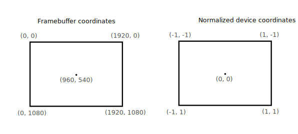

# 图形管线基础

## 简介

后面的章节，我们将会安装配置一个用于渲染第一个三角形的图形管线。图形管线是一系列有序操作的集合，它获取你提供的网格的顶点和纹理，将其转换为渲染目标上的像素点。下图是一个简单的过程展示


输入装配阶段 会从你指定的缓冲区收集原始的顶点数据，也许也会使用索引缓冲，以此减少重复顶点的数据量。

顶点着色器 它是逐顶点运行的，通常在顶点着色器中完成顶点位置的转换，将模型坐标转为屏幕坐标。也会将每个顶点的数据传给着色器的下一个阶段。

细分着色器允许你基于确定的规则去细分集合体，从而让网格获得更高的质量。例如其通常用于将砖块台阶这些物体看起来不是那么平坦。

几何着色器被运行在每一个图元上(三角形，线段，点),它可以丢弃这些图元，或者生成更多的图元。这与细分着色器很像，但是更加灵活。但是，大多数应用中并没有用到它，因为它在除Intel之外的显卡上，性能表现不佳。

光栅化阶段，会将之前的图元拍散到片段中.片段是指将会被写入帧缓冲区的像素，任何超出屏幕显示范围的片段都会被丢弃掉，前面顶点着色器的输入，会在片段着色器中被插值。通常，如果片段着色器被其他的片原片段所覆盖，也会因为深度测试被丢弃掉。

片段着色器会被每一个之前步骤存活下来的片段所调用，以决定要像帧缓冲区中写入什么样的颜色值和深度值。它也可以使用从顶点着色器传来经过插值的数据，通常是纹理坐标、光照法线等。

颜色混合会针对映射到相同像素点的片段，执行混合操作，最简单的是覆盖掉原有值，或者增加原始值，抑或是进行透明度混合。

绿色标识出的阶段，被称为固定功能阶段，这些阶段允许你使用参数调整他们的操作，但是这些阶段是预先已经定义好的，不可修改。

另外的黄色标识的阶段是可编程的,这意味着你可以上传自己的代码给显卡，以完成任何你想要的操作。例如，可以使用片段着色器，实现从纹理到照明到光线追踪。。。,这些程序并行运行在许多GPU核上。

如果你之前用过诸如OpenGL或者Direct3D等其他图形API，你可以使用如 glBlendFunc 或者 OMSetBlendState 去修改图形管线的设置.Vulkan中的图形管线几乎是完全不可变的，所以如果你想去修改着色器、绑定不同的帧缓冲、修改混合模式，必须重建图形管线.缺点是你不得不创建大量的管线以代表不同的渲染操作，然而由于所有的管线都提前知晓了，驱动层就可以做更多定制性的优化了。

基于你的需求，有些可编程的阶段是可选的。例如，如果你只想绘制简单的几何图形，细分着色器和几何着色器可以被禁用。如果你仅对深度值感兴趣，可以禁用片段着色，这对于阴影贴图的生成很有用。

在下一章，我们会创建两个对于显示三角形所必须的可编程阶段: 顶点着色器 和 片段着色器。固定功能的设置，例如混合模式，视口变换，光栅化等都会在那之后予以讨论。最后一部分是关于帧缓冲的输入与输出规范。

创建一个 createGraphicsPipeline() 函数,在createImageViews 之后调用。我们整个一章都会在这个函数里进行。

```C++
void initVulkan() {
    createInstance();
    setupDebugMessenger();
    createSurface();
    pickPhysicalDevice();
    createLogicalDevice();
    createSwapChain();
    createImageViews();
    createGraphicsPipeline();
}

...

void createGraphicsPipeline() {

}
```

下一章会讨论，能真正在屏幕上绘制出内容的着色器模块。

## 着色器模块

GLSL 与 HLSL都是以文本形式提供着色器代码的，与这些API不同，Vulkan的着色器代码必须以二进制字节码的格式给出。这种格式被称作 SPIR-V，它被设计用于Vulkan 和 OpenCL ，这是一个可以被用于写计算和图像shader的格式，我们在此教程中会聚焦于着色器在图形管线中的应用。

使用比特码的好处是，对GPU生产商来说，实现由着色器代码到本地代码的编译器不会太过复杂。过去的经验表明，人类可读的着色器代码，例如GLSL，对其语义的解释标准是相当灵活的。如果你为一个GPU驱动写了一个着色器程序，在其他GPU上运行，可能会报出一个语法上的错误，或者更糟，由于编译器的bug，你的着色器运行效果是不一样的。直接使用 SPIR-V 格式的二进制码，很可能会避免这些问题。

然而，这并不意味着我们需要手写二进制码。Khronos已经为我们提供了一个独立于厂商的编译器，可以将glsl语言转换为SPIR-V的二进制格式。这个编译器会验证你的shader代码是否符合标准并会生成一个SPIR-V格式的二进制文件。也可以将这个编译器用作一个依赖库，用于在运行时动态生成二进制码，但在此教程中，我们并不会这么做。尽管我们可以直接使用 glslangValidator.exe ,但是这里还是使用谷歌提供的 glslc.exe 来代替。glslc的优势是，可以使用与gcc、Clang这些编译器相同的参数，并且它也包含了一些额外的功能，例如include, 这两个文件都是包含在 Vulkan的SDK中的，我们不必再去额外下载它们了。

GLSL是一个与C语言类似的着色器语言。程序以main函数为入口，与其他程序使用参数作为输入，返回值作为输出不同，着色器程序使用全局变量去处理输入和输出。该语言包含许多特性是为图形程序设计的，例如内建的向量类型 vec*,矩阵类型 mat*，也提供了诸如，向量的叉乘，矩阵向量乘法，求一个向量的反射向量这些操作。向量类型以vec开头，跟上向量的维度,如vec2,vec3,vec4。举个例子，一个3D的位置数据可被存储为vec3,也可以通过.x .y .z 来访问单个成员，也可以从多个成员中创建出一个新的向量，例如,vec3(1.0, 2.0, 3.0).xy 会创建出一个 vec2 类型， 向量构造器也可以结合向量对象和标量值，例如一个vec3类型可以这样构造 vec3(vec2(1.0f , 2.0f) , 3.0f)

前面提到，我们需要实现一个顶点着色器和片段着色器来在屏幕上绘制出一个三角形，后面两章将会介绍着色器代码，在此之后，会展示怎样生成SPIR-V字节码，并将它们导入到程序中。

### 顶点着色器

顶点着色器运行在每一个输入的顶点上，顶点会携带属性进入顶点着色器，例如模型的空间坐标位置、颜色、法线、纹理坐标等，输出是最终在裁剪坐标系下的位置，以及需要传递给片段着色器的属性，例如颜色和纹理坐标。这些值会在光栅化阶段被插值，以实现平滑的效果。

裁剪坐标系是一个有顶点着色器生成的四维向量，随后将四维向量全都除以最后一个向量，转为归一化的设备坐标系，这些设备归一坐标是一个将帧缓冲映射到 x:[-1,1] y:[-1,1]的坐标系，如图 



如果你之前涉猎过计算机图形学，应该对此很熟悉。如果之前使用过 OpenGL,应该注意到这里Y轴的方向被翻转了，Z轴的坐标使用了与DirectX3D 相同的范围 [0 , 1.0]

我们的第一个三角形程序并不会应用任何的变换，只需要直接指定三个顶点作为屏幕坐标，创建出如下的图形


通过在顶点着色器中，设置裁剪坐标系的最后一项为1的方式，可以直接输出屏幕归一坐标系，这种方式在裁剪坐标系到屏幕归一化坐标系的转换中不会修改任何的值。

通常这些坐标数据会被存储进一个顶点缓冲区，可是在Vulkan中创建顶点缓冲区，并为其填充数据，并不容易。因此我们决定推迟这些内容的介绍，转而采用一种非正统的方式,将数据直接内置在顶点着色器中，代码如下

```glsl
#version 450

vec2 position[3] = vec2[]{
    vec2(0.0f, -0.5f),
    vec2(0.5f, 0.5f),
    vec2(-0.5f, 0.5f)
};

void main(){
    gl_Position = vec4(position[gl_VertexIndex], 0.0f, 1.0f);
}
```

主函数会被每一个顶点调用，它内建了 gl_VertexIndex 变量标识当前顶点的索引，通常会把这个顶点应用于顶点缓冲区，可是在我们的例子里，我们把这个索引值用在硬编码的一个顶点数组数据中。每一个顶点的位置都是从这个常量数组中取得的，再结合上假的z 和 w 分量，去生成出一个裁剪坐标系下的位置数据，内建的 gl_Position 是最终的输出。

### 片段着色器

三角形是由顶点着色器提供的位置，填充片段构成的屏幕上的一块区域，片段着色器会在这些片段上被调用，去给帧缓冲区提供颜色和深度。一个简单的输出红色三角形的片段着色器如下

```glsl
#version 450

layout(location = 0) out vec4 outColor;

void main(){
    outColor = vec4(1.0f , 0.0f , 0.0f, 1.0f);
}
```

像顶点着色器一样，main函数被每一个片段所调用。在片段着色器中，颜色用一个4个分量的向量来表示，分别代表R、G、B 和 Aplha 通道，取值范围是 0 ~ 1, 与顶点着色使用 gl_Position 内建变量作为输出不同，片段着色器并没有这样的内建变量作为颜色的输出。你必须为每一个帧缓冲指定自己的输出变量,这行 layout(location = 0) 就代表了帧缓冲区的索引。红色被写入到连接了第一个也是唯一一个帧缓冲区的 outColor 变量中.

### 每个顶点设置颜色

一个纯红色的三角形看起来并不有趣，下面这个更漂亮的三角形如何实现呢？


我们需要对着色器做一些修改来完成这个效果。首先需要为三个顶点中的每一个都设置一个不一样的颜色，顶点着色器现在可以包含一个颜色数组，与位置数组类似。

```glsl
vec3 colors[3] = vec3[]{
    vec3(1.0f , 0.0f , 0.0f),
    vec3(0.0f , 1.0f , 0.0f),
    vec3(0.0f , 0.0f , 1.0f)
};
```

现在我们可以把每个顶点的颜色传输给片段着色器，它可以将颜色插值后输出给帧缓冲。顶点着色器中增加一个输出，main函数中写入。

```glsl
layout(location = 0) out vec3 fragColor;

void main() {
    gl_Position = vec4(positions[gl_VertexIndex], 0.0, 1.0);
    fragColor = colors[gl_VertexIndex];
}
```

下一步，需要在片段着色器中添加一个匹配的输入。

```glsl
layout(location = 0) in vec3 fragColor;

void main() {
    outColor = vec4(fragColor, 1.0);
}
```

输入变量没有必要与顶点着色器中的输出取一样的名字，它们是通过索引(location指定)关联在一起的，main函数已经被修改成了输出的颜色加上一个透明度的值。如上面图片所示，fragColor的值，是三个顶点自动插值完成的，这样就实现了平滑的渐变效果。

### 编译着色器

在你的工程的根目录下创建一个 shaders 目录，存储顶点着色器的代码到文件 shader.vert ,再创建一个包含片段着色器的代码文件 shader.frag , GLSL并没有一个官方的扩展名，通常用vert、frag这两个扩展名来区分它们。

shader.vert的内容

```glsl
#version 450

layout(location = 0) out vec3 fragColor;

vec2 positions[3] = vec2[](
    vec2(0.0, -0.5),
    vec2(0.5, 0.5),
    vec2(-0.5, 0.5)
);

vec3 colors[3] = vec3[](
    vec3(1.0, 0.0, 0.0),
    vec3(0.0, 1.0, 0.0),
    vec3(0.0, 0.0, 1.0)
);

void main() {
    gl_Position = vec4(positions[gl_VertexIndex], 0.0, 1.0);
    fragColor = colors[gl_VertexIndex];
}
```

shader.frag 文件内容

```GLSL
#version 450

layout(location = 0) in vec3 fragColor;

layout(location = 0) out vec4 outColor;

void main() {
    outColor = vec4(fragColor, 1.0);
}
```

现在可以用 glslc 将它们编译成 SPIR-V格式的字节码

#### Windows

创建一个批处理命令 compile.bat 内容如下

```bat
C:/VulkanSDK/x.x.x.x/Bin/glslc.exe shader.vert -o vert.spv
C:/VulkanSDK/x.x.x.x/Bin/glslc.exe shader.frag -o frag.spv
pause
```

用你自己的 glslc.exe 路径替换批处理命令中的，双击运行。

#### Linux

创建一个 shell文件 compile.sh，内容如下

```sh
/home/user/VulkanSDK/x.x.x.x/x86_64/bin/glslc shader.vert -o vert.spv
/home/user/VulkanSDK/x.x.x.x/x86_64/bin/glslc shader.frag -o frag.spv
```

用你自己的 glslc 路径替换命令行中的，修改compile.sh的执行权限 chmod +x compile.sh ，然后运行它。

#### 平台特定指令结束

这两行命令告诉编译器读取 GLSL 源码，使用-o 输出一个SPIR-V的二进制字节码.

如果你的着色器代码包含语法错误，编译器会告诉你哪一行报错，试着删除一个分号再运行.再试试去掉命令行的参数去运行编译器,去看看编译器支持哪些特性，也可以从SPIR-V格式输出一个人类可读的格式，以便于你去查看这个阶段，编译器做了哪些优化。

在命令行中去编译着色器的代码是最常用的一种使用方式，也是我们在此教程中会使用的，不过也支持从你的代码中直接编译着色器的代码，有关的Vulkan SDK包含在 libshaderc 中， 它是一个库，可以帮助你在程序中将GLSL代码编译成 SPIR-V 字节码。

### 载入着色器程序

现在我们已经可以生成SPIR-V格式的着色器了，是时候将它载入到我们的程序中，并在渲染管线的一些阶段使用着色器了，首先实现一个简单的载入二进制数据的辅助函数。

```C++
#include <fstream>
...

static std::vector<char> readFile(const std::string& filename) {
    std::ifstream file(filename, std::ios::ate | std::ios::binary);

    if (!file.is_open()) {
        throw std::runtime_error("failed to open file!");
    }
}
```

readFile 函数会读取指定文件的所有字节，并作为 std::vector 来返回.我们以两个标志位来打开指定文件

- ate : 从文件末尾开始读取
- binary : 将文件作为二进制读取(避免文本字符的转换)
  
在文件末尾读取，我们就可以知道文件的大小，从而分配出足够的缓存。

```C++
size_t fileSize = (size_t) file.tellg();
std::vector<char> buffer(fileSize);
```

之后我们便可以返回文件的开始处，一次读取出所有的字节

```C++
file.seekg(0);
file.read(buffer.data(), fileSize);
```

最后，关闭文件返回字节数据.

```C++
file.close();

return buffer;
```

现在，在createGraphicsPipeline中调用这个函数，去载入两个字节码。

```C++
void createGraphicsPipeline() {
    auto vertShaderCode = readFile("shaders/vert.spv");
    auto fragShaderCode = readFile("shaders/frag.spv");
}
```

确保着色器已经被正确的载入了，打印出缓冲的大小与文件实际的大小做对比，注意，这里读取的内容不需要设置结束符,因为它是二进制码，我们会显式地说明它的大小。

### 创建着色器模块

在我们把这些代码传递给管线之前，必须将它们包裹进一个 VkShaderModule 的对象中.我们创建一个辅助函数 createShaderModule 来做这些

```C++
VkShaderModule createShaderModule(std::vector<char> &code){

}
```

函数接收一个字节码的缓存作为参数，利用它创建出 VkShaderModule.

创建着色器模块很简单，只需要指定一个指向字节码数据的指针，以及它的长度。这些信息在 VkShaderModuleCreateInfo 结构体中设置，一个需要注意的点是比特码的大小是以字节大小为单位的，但是参数接收的数据是32位的 uint32_t 指针类型,而不是读取时的 char 指针类型,因此我们需要将指针通过 reinterpret_cast 进行转换，当做出这样转化时，需要保证数据满足 uin32_t 类型的对齐要求，幸运的是，存储在 std::vector 容器中的数据，其分配时就已经确保了数据满足这样的要求。

```C++
VkShaderModuleCreateInfo createInfo{};
createInfo.sType = VK_STRUCTURE_TYPE_SHADER_MODULE_CREATE_INFO;
createInfo.codeSize = code.size();
createInfo.pCode = reinterpret_cast<const uint32_t *>(code.data());
```

调用 vkCreateShaderModule 去创建 VkShaderModule 

```C++
VkShaderModule shaderModule;
if (vkCreateShaderModule(device, &createInfo, nullptr, &shaderModule) != VK_SUCCESS) {
    throw std::runtime_error("failed to create shader module!");
}
```

参数与之前创建Vulkan对象的函数参数是一样的，逻辑设备，创建信息，可选的分配回调，以及创建出的返回对象指针，代码的缓存可以在创建完对象后被立即释放。不要忘记返回创建的对象

```C++
return shaderModule;
```

着色器模块仅仅是对字节码的一个简单包装，将SPIR-V字节码编译链接成CPU可运行的二进制文件，在图形管线创建之前并不会完成。这也意味着当我们创建完图形管线后，就可以立刻销毁着色器模块了,这也解释了为什么我们使用的是本地变量作为着色器模块，而不是类成员变量。

```C++
void createGraphicsPipleline(){
    auto vertShaderCode = readFile("shaders/vert.spv");
    auto fragShaderCode = readFile("shaders/frag.spv");

    VkShaderModule vertShaderModule = createShaderModule(vertShaderCode);
    VkShaderModule fragShaderModule = createShaderModule(fragShaderCode);

```

清除操作在函数末尾通过两个 vkDestroyShaderModule 调用来完成.所有本章后面添加的代码，都在这两个函数调用之前

```C++
 ...
    vkDestroyShaderModule(device, fragShaderModule, nullptr);
    vkDestroyShaderModule(device, vertShaderModule, nullptr);
}
```

### 着色阶段的创建

为了实际使用这些着色器，我们需要将使用 VkPipelineShaderStageCreateInfo 结构体将着色器关联到管线阶段，它是创建实际渲染管线操作的一部分。

我们在createGraphicsPipeline函数中填写这个结构体，将它作为顶点着色器

```C++
VkPipelineShaderStageCreateInfo vertShaderStageInfo{};
vertShaderStageInfo.sType = VK_STRUCTURE_TYPE_PIPELINE_SHADER_STAGE_CREATE_INFO;
vertShaderStafeInfo.stage = VK_SHADER_STAGE_VERTEX_BIT;
```

第一步，告诉Vulkan,将要使用的是着色器的哪一个阶段，前面介绍的每一个可编程阶段，都有一个枚举类型表示。

```C++
vertShaderStageInfo.module = vertShaderModule;
vertShaderStageInfo.pName = "main";
```

后面的两个参数，指定了着色器模块应该包含的代码,以及被调用的函数，即理解的函数入口。这意味着可以将一个顶点着色器与多个片段着色器绑定到一起，并且使用不同的入口点来区分着色器的行为。本例中，我们使用标准的 main 函数。

还有一个可选成员 pSpecicalizationInfo , 虽然我们这里并不使用它，但是它是值得被讨论一下的,它允许你去指定着色器常量值。你可以使用单个的着色器模块，它的行为可以在管线创建时，通过不同的常量值来指定。这比起在渲染时配置着色器，具有更高的效率，因为编译器可以做，诸如消除与此变量关联的 if 语句
这样的优化操作。如果并没有这样的常量，可以设置这个成员时 nullptr,也是我们在初始化这个结构体时自动设置的值。

修改结构体的填写来实现片段着色器的创建

```C++
VkPipelineShaderStageCreateInfo fragShaderStageInfo{};
fragShaderStageInfo.sType = VK_STRUCTURE_TYPE_PIPELINE_SHADER_STAGE_CREATE_INFO;
fragShaderStageInfo.stage = VK_SHADER_STAGE_FRAGMENT_BIT;
fragShaderStageInfo.module = fragShaderModule;
fragShaderStageInfo.pName = "main";
```

最后，创建包含这两个结构体的数组，我们会在之后实际创建管线的阶段，引用这个数组。

```C++
VkPipelineShaderStageCreateInfo shaderStages[] = {vertShaderStageInfo, fragShaderInfo};
```

这就是对管线可编程阶段的所有介绍了。下一章，我们会介绍管线的固定功能阶段。

## 固定功能

早先的图形API对大多数的图形管线状态都设置了默认值，但在Vulkan中，你必须显式地声明出大多数地图形管线状态，因为它们会被当成不可变的管线对象.本章，我们会填写所有的固定功能的结构体以完成管线的配置。

### 动态状态

尽管大多数的管线状态都需要被写死，仍然有一些状态可以在渲染时被改变而不用重建渲染管线，例如视口的大小，线段宽度和混合的颜色。如果你想使用这些动态状态，将这些属性排除在固定功能外,需要填写 VkPipelineDynamicStateCreateInfo 结构体.

```C++
std::vector<VkDynamicState> dynamicStates = {
    VK_DYNAMIC_STATE_VIEWPORT,
    VK_DYNAMIC_STATE_SCISSOR
};

VkDynamicStateCreateInfo dynamicState{};
dynamicState.sType = VK_STRUCTURE_TYPE_PIPELINE_DYNAMIC_STATE_CREATE_INFO;
dynamicState.dynamicStateCount = static_cast<uint32_t>(dynamicStates.size());
dynamicState.pDynamicStates = dynamicStates.data();
```

这将会让这些值被忽略，你可以（也必须）在绘制时，指定这些值。这种方式更加的灵活，相比于将一些诸如裁剪，视口的状态写死进渲染管线中。

### 顶点输入

VkPipelineVertexInputStateCreateInfo 结构体描述了将要传送给顶点着色器的顶点数据的格式，大体用两种方法描述这些:

- 绑定(Bindings) : 数据之间的间隔，是否数据是逐顶点的还是逐实例的。
- 属性描述 : 传递给顶点着色器的属性类型，从哪个绑定点偏移多少去加载。

因为我们已经直接在顶点着色器中做了数据的硬编码，所以现在这个结构体并不需要顶点数据，会在后面的章节再来设置它

```C++
VkPipelineVertexInputStateCreateInfo vertexInputInfo{};
vertexInputInfo.sType = VK_STRUCTURE_TYPE_PIPELINE_VERTEX_INPUT_STATE_CREATE_INFO;
vertexInputInfo.vertexBindingDescriptionCount = 0;
vertexInputInfo.pVertexBindingDescriptions = nullptr; // Optional
vertexInputInfo.vertexAttributeDescriptionCount = 0;
vertexInputInfo.pVertexAttributeDescriptions = nullptr; // Optional
```

成员 pVertexBindingDescriptions 和 pVertexAttributeDescriptions ,都是一个指向结构体数组的类型，用来在加载顶点数据时，描述数据的细节。在 createGraphicsPipeline 函数中，将这个结构体初始化的代码加在 shaderStage 逻辑之后。

### 输入装配

VkPipelineInputAssemblyStateCreateInfo 结构体描述了两个东西，1.需要从顶点绘制哪一种几何体 2.是否需要打开图元重启功能. 前者通过 topology 成员来指定,它有如下这些取值:

- VK_PRIMITIVE_TOPOLOGY_POINT_LIST : 通过顶点绘制点精灵
- VK_PRIMITIVE_TOPOLOGY_LINE_LIST : 每两个顶点绘制一条线段，没有重用的顶点
- VK_PRIMITIVE_TOPOLOGY_LINE_STRIP : 仍是绘制直线，但是每一条线段结束的顶点用于下一条线段开始的顶点
- VK_PRIMITIVE_TOPOLOGY_TRIANGLE_LIST : 每三个顶点绘制一个三角形,没有顶点重用
- VK_PRIMITIVE_TOPOLOGY_TRIANGLE_STRIP : 每一个三角形的第二第三个顶点作为后一个三角形的前两个顶点
  
通常，顶点按索引的顺序从顶点缓冲区被载入，但是你也可以使用元素缓冲区，加载自己的索引值.这可以实现针对顶点重用的优化，如果这时，你设置了 primitiveRestartEnable 成员为 VK_TRUE, 在以 _STRIP 为拓扑结构的绘制中，就可以断开连续绘制的效果，通常这里把索引设置为 0xFFFF 或者 0xFFFFFFFF.

本教程中，我们绘制的是三角形，所以结构体需要做如下设置

```C++
VkPipelineInputAssemblyStateCreateInfo inputAssembly{};
inputAssembly.sType = VK_STRUCTURE_TYPE_PIPELINE_INPUT_ASSEMBLY_STATE_CREATE_INFO;
inputAssembly.topology = VK_PRIMITIVE_TOPOLOGY_TRIANGLE_LIST;
inputAssembly.primitiveRestartEnable = VK_FALSE;
```

### 视口与裁剪

视口描述了帧缓冲区渲染输出的范围，它几乎总是从 (0, 0) 到 (宽，高),教程里我们这样设置

```C++
VkViewport viewport{};
viewport.x = 0.0f;
viewport.y = 0.0f;
viewport.width = static_cast<uint32_t>(swapChainExtent.width);
viewport.height = static_cast<uint32_t>(swapChainExtent.height);
viewport.minDepth = 0.0f;
viewport.maxDepth = 1.0f;
```

注意，这里使用的是交换链的宽高，它的大小可能是与窗口的宽高是不一样的。交换链的图像后面会作为帧缓冲区使用，所以这里我们可以写死这个尺寸。

minDepth 和 maxDepth 指定了使用帧缓冲区的深度值范围，这些值必须被设定在 [0.0f, 1.0f]之间,但是最小值可能会大于最大值。如果你不需要做任何特殊设置，可以将这个值固定在标准的 0.0 到 1.0 。

视口定义了图像到帧缓冲区的转换，裁剪矩形定义了哪些像素点会被存储下来。任何在裁剪矩形之外的像素点都会被光栅器丢弃掉。这个功能相比于转换器更像是一个过滤器.下图展示了它们的不同。注意左侧的裁剪矩形只是众多可能中的一个，因为它是大于视口的。


所以如果我们想要绘制整个帧缓冲区，需要指定裁剪矩形覆盖到整个帧缓冲区.

```C++
VkRect2D scissor{};
scissor.offset = {0, 0};
scissor.extent = swapChainExtent;
```

视口与裁剪，既可以在创建管线的时候静态设置，也可以在命令缓冲中作为动态状态被设置。动态设置有更好的灵活性，这是很常见的，所有驱动都可以处理这种动态状态而没有性能上的损失。

当选择动态的视口与裁剪区域时， 需要显式的打开管线的状态设置。

```C++
std::vector<VkDynamicState> dynamicStates = {
    VK_DYNAMIC_STATE_VIEWPORT,
    VK_DYNAMIC_STATE_SCISSOR
};

VkPipelineDynamicStateCreateInfo dynamicState{};
dynamicState.sType = VK_STRUCTURE_TYPE_PIPELINE_DYNAMIC_STATE_CREATE_INFO;
dynamicState.dynamicStateCount = static_cast<uint32_t>(dynamicStates.size());
dynamicState.pDynamicStates = dynamicStates.data();
```

然后在管线创建的时候指定数量

```C++
VkPipelineViewportStateCreateInfo viewportState{};
viewportState.sType = VK_STRUCTURE_TYPE_PIPELINE_VIEWPORT_STATE_CREATE_INFO;
viewportState.viewportCount = 1;
viewportState.scissorCount = 1;
```

真正的视口及裁剪数据会在渲染时，被装载进来。

甚至，动态状态能为同一个命令缓冲区指定不同的视口和裁剪矩形。

没有动态状态，视口和裁剪矩形需要在 VkPipelineViewportStateCreateInfo 结构体中指定，这会让视口和裁剪矩形在此管线下变成不可变的。如果要修改，只能用新的值创建出新的管线。

```C++
VkPipelineViewportStateCreateInfo viewportState{};
viewportState.sType = VK_STRUCTURE_TYPE_PIPELINE_VIEWPORT_STATE_CREATE_INFO;
viewportState.viewportCount = 1;
viewportState.pViewports = &viewport;
viewportState.scissorCount = 1;
viewportState.pScissors = &scissor;
```

无论如何设置它们，在一些显卡上可能会设置多个视口和裁剪矩形，所以引用对象是一个数组格式。如果要使用多个，需要查询GPU硬件是否支持此特性。

### 光栅器

光栅器获取从顶点着色器提供的几何形状，并将其转换成需要被片段着色器着色的片段。它也会实现深度测试，面剔除和裁剪测试，它也可以配置输出的片段是填充几何体还是仅绘制边沿(线框绘制模式),所有的配置都是用 VkPipelineRasterizationStateCreateInfo 结构体描述

```C++
VkPipelineRasterizationStateCreateInfo rasterizer{};
rasterizer.sType = VK_STRUCTURE_TYPE_PIPELINE_RASTERIZATION_STATE_CREATE_INFO;
rasterizer.depthClampEnable = VK_FALSE;
```

如果 depthClampEnable 被设置成VK_TRUE，对于那些超出近平面和远平面范围的片段，会进行截断而不是舍弃。这对于阴影贴图的场景是很有用的。使用此特性需要检查GPU是否支持。

```C++
rasterizer.rasterizerDiscardEnable = VK_FALSE;
```

如果 rasterizerDiscardEnable 设置为 VK_TRUE,集合体永远不会通过光栅化阶段,这基本不会给帧缓冲输出任何内容。

```C++
rasterizer.polygonMode = VK_POLYGON_MODE_FILL;
```

polygonMode 会决定有多少片段被用于生成几何体。有以下几个取值。

- VK_POLYGON_MODE_FILL : 用片段填充多边形区域
- VK_POLYGON_MODE_LINE : 多边形边沿被绘制
- VK_POLYGON_MODE_POINT : 多边形的顶点以点的形式绘制

使用任何除了FILL之外的模式，都需要GPU的支持.

```C++
rasterizer.lineWidth = 1.0f;
```

 lineWidth 的意义很明显，它用大量的片段描述线段的粗细，线宽的最大值依赖于硬件的支持，任何大于1.0的宽度，都需要先查询GPU是否支持 wideLines 属性。

```C++
rasterizer.cullMode = VK_CULL_MODE_BACK_BIT;
rasterizer.frontFace = VK_FRONT_FACE_CLOCKWISE;
```

 cullMode 设置哪一种类型的面需要被剔除，也可以禁用剔除,剔除前面或者双面都剔除。frontFace 表述顶点以何种顺序来表示前后，是顺时针还是逆时针。

```C++
rasterizer.depthBiasEnable = VK_FALSE;
rasterizer.depthBiasConstantFactor = 0.0f; // Optional
rasterizer.depthBiasClamp = 0.0f; // Optional
rasterizer.depthBiasSlopeFactor = 0.0f; // Optional
```

光栅器可以修改深度值，加上一个常量值或者根据片段的斜率对其添加一个偏置。这有些时候会用在阴影贴图中,但我们现在并不使用它，仅设置 depthBiasEnable 为 VK_FALSE 。
 

### 多重采样

### 深度与模板测试

### 颜色混合

### 管线布局

### 总结

## 渲染通道

## 结论
