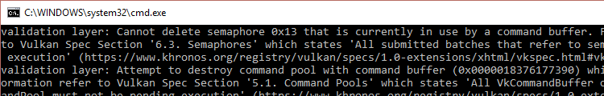

# 绘制

## 帧缓冲

前面章节中我们已经提及了很多次关于帧缓冲了，我们设置了渲染通道，并且期望帧缓冲与交换链具有相同的格式,但是我们还没有实际去创建出帧缓冲。

在渲染通道创建时被指定的附件，被绑定到 VkFrameBuffer 对象中.帧缓冲区所引用的 VkImageView 对象，代表着这些附件。我们的例子中只有一个，便是颜色附件。但是这个图像依赖于交换链在呈现时，返回给我们的是那一张图像，这意味着，我们必须为交换链中的所有图像创建出对应的帧缓冲，在绘制时，使用对应的帧缓冲.

创建一个 std::vector 类型的成员变量，存储多个帧缓冲。

```C++
std::vector<VkFrameBuffer> swapChainFrameBuffers;
```

创建新函数 createFramebuffers ，在initVulkan函数创建完渲染管线后调用它：

```C++
void initVulkan() {
    createInstance();
    setupDebugMessenger();
    createSurface();
    pickPhysicalDevice();
    createLogicalDevice();
    createSwapChain();
    createImageViews();
    createRenderPass();
    createGraphicsPipeline();
    createFramebuffers();
}

...

void createFramebuffers() {

}
```

重置容器的大小，去存储所有的帧缓冲

```C++
void createFramebuffers() {
    swapChainFramebuffers.resize(swapChainImageViews.size());
}
```

然后迭代所有的交换链中的图像，去创建出相同数量的帧缓冲

```C++
for (size_t i = 0; i < swapChainImageViews.size(); i++){
    VkImageView attachments[] = {
        swapChainImageViews[i]
    };

    VkFramebufferCreateInfo framebufferInfo{};
    framebufferInfo.sType = VK_STRUCTURE_TYPE_FRAMEBUFFER_CREATE_INFO;
    framebufferInfo.renderPass = renderPass;
    framebufferInfo.attachmentCount = 1;
    framebufferInfo.pAttachments = attachments;
    framebufferInfo.width = swapChainExtent.width;
    framebufferInfo.height = swapChainExtent.height;
    framebufferInfo.layers = 1;

    if (vkCreateFramebuffer(device, &framebufferInfo, nullptr, &swapChainFramebuffers[i]) != VK_SUCCESS) {
        throw std::runtime_error("failed to create framebuffer!");
    }
}
```

帧缓冲的创建很简单。我们首先指定帧缓冲需要兼容的渲染过程，你只可以使用与这个渲染通道兼容的帧缓冲，兼容的条件可以简单理解为使用了相同类型与数量的附件。

attachmentCount 和 pAttachments 指定了被绑定的 VkImageView 对象，它代表了渲染通道中的附件数组对象。

width 和 height 参数意义很明显，layers 参数代表了图像数组的层数，我们的交换链图像是单个图像，所以这里设置为1 .

需要在结束渲染时，且图像视图与渲染通道销毁前，删除掉帧缓冲

```C++
void cleanup() {
    for (auto framebuffer : swapChainFramebuffers) {
        vkDestroyFramebuffer(device, framebuffer, nullptr);
    }

    ...
}
```

现在已经拥有了所有渲染需要的对象了，下一节我们会写下第一个用于实际渲染的命令。

## 命令缓冲区

Vulkan中的命令，例如绘制操作或内存传输，都不是通过函数调用来直接运行的，你必须在命令缓冲中记录所有的操作，好处是，当我们准备好告诉Vulkan 我们想要做什么的时候，所有的命令都被一起提交给了Vulkan,Vulkan可以更加高效地处理这些命令，并且，也允许记录指令的过程用多个线程去并发地记录。

### 命令池

在创建指令缓冲前，我们必须先创建出一个指令池。指令池会管理从它这里分配的指令缓冲，添加一个新的成员变量去存储指令池.

```C++
VkCommandPool commandPool;
```

创建新函数 createCommandPool ，在创建完帧缓冲后调用它

```C++
void initVulkan() {
    createInstance();
    setupDebugMessenger();
    createSurface();
    pickPhysicalDevice();
    createLogicalDevice();
    createSwapChain();
    createImageViews();
    createRenderPass();
    createGraphicsPipeline();
    createFramebuffers();
    createCommandPool();
}

...

void createCommandPool() {

}
```

命令池的创建仅需要两个参数:

```C++
QueueFamilyIndices queueFamilyIndices = findQueueFamilies(physicalDevice);

VkCommandPoolCreateInfo poolInfo{};
poolInfo.sType = VK_STRUCTURE_TYPE_COMMAND_POOL_CREATE_INFO;
poolInfo.flags = VK_COMMAND_POOL_CREATE_RESET_COMMAND_BUFFER_BIT;
poolInfo.queueFamilyIndex = queueFamilyIndices.graphicsFamily.value();
```

flag值可取以下的两个值

- VK_COMMAND_POOL_CREATE_TRANSIENT_BIT : 提示命令缓冲区会经常被重新记录（也许会改变内存的分配行为）

- VK_COMMAND_POOL_CREATE_RESET_COMMAND_BUFFER_BIT : 允许命令缓冲被单独重置，没有这个设置，它们会被一起重置。
  
我们会为每一帧记录一个命令缓冲，所以我们想重置和重新记录它,因此我们要为命令池设置 VK_COMMAND_POOL_CREATE_RESET_COMMAND_BUFFER_BIT 标志位.

命令缓冲通过提交给设备队列来运行，例如图形队列或呈现队列。每一个命令缓冲池只可以给一种类型的队列分配命令缓冲。我们准备去记录绘制命令，因此在这里选择了图形队列簇的索引填写到 VkCommandPoolCreateInfo 结构体中。

```C++
if (vkCreateCommandPool(device, &poolInfo, nullptr, &commandPool) != VK_SUCCESS) {
    throw std::runtime_error("failed to create command pool!");
}
```

最后使用 vkCreateCommandPool 创建出命令池，它并没有什么特殊的参数，创建出的命令会被用于程序中绘制东西到屏幕上,所以命令池仅可以在程序结束时被销毁.

```C++
void cleanup() {
    vkDestroyCommandPool(device, commandPool, nullptr);

    ...
}
```

### 命令缓冲的分配

现在开始分配命令缓冲.

类成员中创建一个 VkCommandBuffer 对象.命令缓冲会在命令池被销毁时自动清理，所以不需要在 cleanup 中显式清理了。

```C++
VkCommandBuffer commandBuffer;
```

创建 createCommandBuffer 函数，从命令池中新建出命令缓冲。

```C++
void initVulkan(){
    createInstance();
    setupDebugMessenger();
    createSurface();
    pickPhysicalDevice();
    createLogicalDevice();
    createSwapChain();
    createImageViews();
    createRenderPass();
    createGraphicsPipeline();
    createFramebuffers();
    createCommandPool();
    createCommandBuffer();
}

...

void createCommandBuffer() {

}
```

命令缓冲通过 vkAllocateCommandBuffers 函数进行分配，它接收一个 VkCommandBufferAllocateInfo 参数，用于指定从哪个命令池分配及需要分配多少个命令缓冲:

```C++
VkCommandBufferAllocateInfo allocInfo{};
allocInfo.sType = VK_STRUCTURE_TYPE_COMMAND_BUFFER_ALLOCATE_INFO;
allocInfo.commandPool = commandPool;
allocInfo.level = VK_COMMAND_BUFFER_LEVEL_PRIMARY;
allocInfo.commandBufferCount = 1;

if (vkAllocateCommandBuffers(device, &allocInfo, &commandBuffer) != VK_SUCCESS) {
    throw std::runtime_error("failed to allocate command buffers!");
}
```

level 参数指明，分配的命令缓冲是主缓冲还是次级缓冲。

- VK_COMMAND_BUFFER_LEVEL_PRIMARY : 可以被提交给队列直接运行，但是不能从其他命令缓冲中调用。
- VK_COMMAND_BUFFER_LEVEL_SECONDARY : 不可以被直接提交，但是可以从主缓冲中被调用。

我们这里不会使用次级缓冲队列，但是这里从主缓冲中复用常用操作是很有用的。

因为我们只分配了一个命令缓冲，这里commandBufferCount 设置为 1.

### 命令缓冲的录制

现在在函数 recordCommandBuffer 中完成写入命令到命令缓冲的工作，要被写入的 VkCommandBuffer 会作为一个参数传入，同时，交换链的图像索引，也会当成参数传入。

```C++
void recordCommandBuffer(VkCommandBuffer commandBuffer, uint32_t imageIndex){

}
```

开始命令缓冲的录制，我们总是以 vkBeginCommandBuffer 调用开始,它使用 VkCommandBufferBeginInfo 作为参数,其中包含了一些使用命令缓冲的细节。

```C++
VkCommandBufferBeginInfo beginInfo{};
beginInfo.sType = VK_STRUCTURE_TYPE_COMMAND_BUFFER_BEGIN_INFO;
beginInfo.flags = 0; // Optional
beginInfo.pInheritanceInfo = nullptr; // Optional

if (vkBeginCommandBuffer(commandBuffer, &beginInfo) != VK_SUCCESS) {
    throw std::runtime_error("failed to begin recording command buffer!");
}
```

flags 参数指定了我们希望怎样去使用命令缓冲，可以有以下取值：

- VK_COMMAND_BUFFER_USAGE_ONE_TIME_SUBMIT_BIT ： 表示命令只会被提交一次
- VK_COMMAND_BUFFER_USAGE_RENDER_PASS_CONTINUE_BIT : 该命令缓冲区将会作为一个次级命令缓冲区,用于渲染通道的一个子过程。 
- VK_COMMAND_BUFFER_USAGE_SIMULTANEOUS_USE_BIT : 允许命令缓冲区在多个队列提交中并发使用。

这些标志目前我们都用不上。

pInheritanceInfo 参数仅与次级命令缓冲区相关,它指定了从主命令缓冲区继承哪个状态。

如果命令缓冲已经被记录了一次了，再次调用 vkBeginCommandBuffer ，将会隐式地重置它，不可能在命令缓冲中再继续添加命令。

### 开始一个渲染过程

通过 vkCmdBeginRenderPass 开始绘制过程。填写结构体 VkRenderPassBeginInfo 。

```C++
VkRenderPassBeginInfo renderPassInfo{};
renderPassInfo.sType = VK_STRUCTURE_TYPE_RENDER_PASS_BEGIN_INFO;
renderPassInfo.renderPass = renderPass;
renderPassInfo.framebuffer = swapChainFramebuffers[imageIndex];
```

第一个参数是渲染通道自身，以及它所绑定的附件。我们为交换链的每一个图像都创建了帧缓冲，它在这里被指定为颜色附件。因此我们需要给想要绘制的图像绑定帧缓冲。使用传递进来的图像索引参数，可以让我们选择出正确的当前正在使用的帧缓冲。

```C++
renderPassInfo.renderArea.offset = {0, 0};
renderPassInfo.renderArea.extent = swapChainExtent;
```

接下来的两个参数，定义了渲染区域的大小。此区域之外的像素点，值是未定义的。需要匹配附件的大小以获得最佳的效能。

```C++
VkClearValue clearColor = {{{0.0f, 0.0f, 0.0f, 1.0f}}};
renderPassInfo.clearValueCount = 1;
renderPassInfo.pClearValues = &clearColor;
```

最后的两个参数定义了,使用 VK_ATTACHMENT_LOAD_OP_CLEAR 设置时，在载入时候需要的清理颜色,会在清理颜色附件时使用到，这里定义清除的颜色为不透明的黑色。

```C++
vkCmdBeginRenderPass(commandBuffer, &renderPassInfo, VK_SUBPASS_CONTENTS_INLINE);
```

渲染通道现在可以开始了，所有在命令缓冲中被记录的函数调用都以 vkCmd 为开头，它们的返回值都是空的，所以这里并没有错误处理，直到我们结束录制。

第一个参数是需要被记录的命令缓冲，第二个参数指定了渲染过程的细节。第三个参数指定了绘制命令如何被提供，它有两个取值:

- VK_SUBPASS_CONTENTS_INLINE : 渲染通道中的命令会嵌入到主命令缓冲区，没有次级缓冲区被运行。
- VK_SUBPASS_CONTENTS_SECONDARY_COMMAND_BUFFERS : 渲染通道的命令可以从次级缓冲区运行。

我们并不使用次级缓冲区，所以这里选第一个。

### 基础的绘制指令

现在可以绑定图形管线了 

```C++
vkCmdBindPipeline(commandBuffer, VK_PIPELINE_BIND_POINT_GRAPHICS, graphicsPipeline);
```

第二个参数指定是图形管线还是计算管线。我们现在已经告诉了 Vulkan,在图形管线中运行什么样的操作，在片段着色器中使用哪一个附件。

在管线固定功能一节中，已经说过，我们必须动态指定视口和裁剪状态,所以在绘制命令前，需要设置这两个状态.

```C++
VkViewport viewport{};
viewport.x = 0.0f;
viewport.y = 0.0f;
viewport.width = static_cast<float>(swapChainExtent.width);
viewport.height = static_cast<float>(swapChainExtent.height);
viewport.minDepth = 0.0f;
viewport.maxDepth = 1.0f;
vkCmdSetViewport(commandBuffer, 0, 1, &viewport);

VkRect2D scissor{};
scissor.offset = {0, 0};
scissor.extent = swapChainExtent;
vkCmdSetScissor(commandBuffer, 0, 1, &scissor);
```

现在可以发出真正的三角形的绘制命令了

```C++
vkCmdDraw(commandBuffer, 3, 1, 0, 0);
```

真正的 vkCmdDraw 函数有一点虎头蛇尾了，它如此简单的原因是我们之前已经提前做了很多事情。在命令缓冲参数后面跟着如下几个参数:

- vertexCount : 尽管我们没有顶点缓冲数据，仍然需要提供三个需要被绘制的顶点.
- instanceCount ： 用来绘制的实例的数量，如果不使用实例绘制这里写1.
- firstVertex : 用来作为一个顶点缓冲区的偏移。定义了着色器中 gl_VertexIndex 的第一个值.
- firstInstance : 实例绘制模式的偏移量，定义了着色器中 gl_InstanceIndex 的第一个值.

### 完成

现在可以结束渲染通道了

```C++
vkCmdEndRenderPass(commandBuffer);
```

然后我们结束命令缓冲区的录制：

```C++
if(vkEndCommandBuffer(commandBuffer) != VK_SUCCESS){
    throw std::runtime_error("failed to record command buffer!");
}
```

下一章，我们会在主循环中添加代码,代码逻辑是，从交换链中获取一幅图像，录制并允许命令缓冲，再将渲染好的图像返还给交换链。

## 渲染与呈现

在这一章中，之前所创建的东西都汇聚到了一起。我们将要去实现 drawFrame 函数，它将在主循环中被调用，从而渲染出在屏幕上的三角形。

```C++
void mainLoop() {
    while (!glfwWindowShouldClose(window)) {
        glfwPollEvents();
        drawFrame();
    }
}

...

void drawFrame() {

}
```

### 框架的轮廓

从一个较高的层级上看，使用Vulkan渲染一帧有以下步骤：

- 等待前一帧结束
- 从交换链中请求一幅图像
- 将绘制场景的命令记录到一个与这副图像关联的命令缓冲区
- 提交记录好的命令缓冲
- 呈现交换链的图像
  
虽然我们会在后面的章节中扩展绘制功能，但现在这就是渲染循环的核心。

### 同步

Vulkan的核心设计哲学是 明确GPU的运行都是同步的.我们使用各种同步原语告诉驱动我们所期望的运行效果。这意味着在GPU上运行的Vulkan代码是异步进行的,函数的调用会在操作结束前返回。

在本章，有大量的事件我们需要去显式地定义它地顺序,因为它们是在GPU上异步运行的.例如:

- 从交换链中请求一幅图像
- 对请求的图像运行绘制指令
- 返回图像给交换链，将图像显式到屏幕上
  
每一个事件都使用了一个函数的调用。可是它们都是异步运行的，函数调用可能会在实际的操作完成前返回,它们的顺序是不确定的。很遗憾，我们这里每一个操作都需要依赖前一步的操作。因此，我们需要看一看有哪些同步原语可以帮助我们达到期望的运行顺序。

#### 信号量 (Semaphores)

信号量用于保证队列操作的顺序。队列中的操作依赖于我们的提交，它即可能来自于命令缓冲也可能来自于一个函数，示例中包含了图形队列和显式队列，信号量既可以同步同一个队列的操作，也可以用来同步不同队列的操作。

Vulkan中有两种类型的信号量，布尔型和时间型，本教程中我们仅使用布尔型，未来提到信号量，指的都是布尔型。

一个信号量有两个状态，有信号及无信号，最开始时是无信号状态.为了保证队列的操作顺序，我们一般这样使用信号量，在一个队列中提供有信号的信号量，在另一个队列中等待这个信号量的信号。例如，假设我们拥有信号量S，想要顺序执行队列操作A,B. 我们告诉Vulkan API 操作A会设置S为有信号状态，操作B会在运行前等待信号量S。在操作B运行后，信号量S会被重新重置为无信号状态以便下一次使用。

上面描述伪代码如下

```C++
VkCommandBuffer A, B = ... // record command buffers
VkSemaphore S = ... // create a semaphore

// enqueue A, signal S when done - starts executing immediately
vkQueueSubmit(work: A, signal: S, wait: None)

// enqueue B, wait on S to start
vkQueueSubmit(work: B, signal: None, wait: S)
```

以上代码调用的 vkQueueSubmit 会立即返回，等待操作只会发生在GPU上，CPU 则不会被阻塞，而是继续运行。为了让CPU等待，我们需要另外一种同步原语，即接下来要描述的Fences栅栏。

#### 栅栏 (Fences)

栅栏也是用于同步操作的,但它是在CPU上用于保证执行顺序的,简单理解，如果宿主机（即CPU）想要知道GPU的一些操作是否完成，就可以使用栅栏。(后面我们使用fence代替中文)

与信号量相似，fence也分为有信号状态和无信号状态。任何时候，我们提交的工作都可以关联一个fence，当工作结束的时候，fence就会被置为有信号状态。我们可以让宿主机等待fence变为有信号态,以保证在继续工作前必须的工作已经完成。

一个具体的例子是截屏。我们已经在GPU上完成了必要的工作，现在需要将GPU中的图像送入宿主机，并保存在文件上，我们让命令缓存A去运行传输命令，并将操作关联到fecen F,现在提交命令缓存A 和 F，并立即告诉宿主机需要等待fence F，这就会让宿主机一直等待，直到命令缓冲A运行结束，因为此时传输已经结束了，我们可以安全地将数据保存到文件中。

上述操作的伪代码:

```C++
VkCommandBuffer A = ... // record command buffer with the transfer
VkFence F = ... // create the fence

// enqueue A, start work immediately, signal F when done
vkQueueSubmit(work: A, fence: F)

vkWaitForFence(F) // blocks execution until A has finished executing

save_screenshot_to_disk() // can't run until the transfer has finished
```

与信号量的例子不同，此例中会阻塞程序的运行，这意味着宿主机不会做任何操作，直到Fence 关联的操作结束。在截图的例子中，我们必须确保传输操作已经完成了，才能将数据保存到文件中。

一般，除非必须，最好不要阻塞宿主机的运行，我们期望GPU和宿主机都在做有用的工作。等待fence变为有信号状态并不算有用的工作。因此更倾向于选择信号量或其他的还没介绍的同步原语。

fence必须被手动重置为无信号状态，这是因为fence被用于控制宿主机的运行，宿主机自己可以决定重置时机,相比于信号量，它的同步工作发生在GPU上并不会涉及到宿主机。

总结一下，信号量被用于指定在GPU上的操作顺序，栅栏被用于保证CPU于GPU之间的同步。

#### 如何选择？

我们现在有两种同步原语可以选择，有两个地方可以方便的使用同步：操作交换链 和 等待前一帧绘制完成。我们想对交换链的操作使用信号量，因为它发生在GPU上，而对于等待前一帧的绘制结束，我们会使用fence,因为这里需要让宿主等待。这里我们并不会同时绘制一张以上的图像，因为我们会为每一帧记录命令缓冲，我们并不会记录下一帧的命令缓冲，直到当前帧运行结束，并不想当GPU使用命令缓冲时，去覆盖掉命令缓冲里的内容。

### 创建同步对象

我们需要两个信号量,一个去通知已经从交换链中准备好要渲染的图像了,一个通知渲染已经完成可以显示到屏幕上了,还需要一个fence，以确保每次只有一帧图像正在被渲染。 

创建三个类成员去存储信号量和fence.

```C++
VkSemaphore imageAvailableSemaphore;
VkSemaphore renderFinishSemaphore;
VkFence inFlightFence;
```

创建 createSyncObjects 函数，在initVulkan末尾调用它。

```C++
void initVulkan() {
    createInstance();
    setupDebugMessenger();
    createSurface();
    pickPhysicalDevice();
    createLogicalDevice();
    createSwapChain();
    createImageViews();
    createRenderPass();
    createGraphicsPipeline();
    createFramebuffers();
    createCommandPool();
    createCommandBuffer();
    createSyncObjects();
}

...

void createSyncObjects() {

}
```

创建信号量需要填写 VkSemaphoreCreateInfo 结构体,目前的版本仅需要填写一个sType字段

```C++
void createSyncObjects(){
    VkSemaphoreCreateInfo semaphoreInfo{};
    semaphoreInfo.sType = VK_STRUCTURE_TYPE_SEMAPHORE_CREATE_INFO;
}
```

未来的Vulkan版本中，会添加新的Flag 或者 pNext参数。

创建Fence需要填写 VkFenceCreateInfo 结构体

```C++
VkFenceCreateInfo fenceInfo{};
fenceInfo.sType = VK_STRUCTURE_TYPE_FENCE_CREATE_INFO;
```

创建信号量 和 栅栏模式基本相同 使用 vkCreateSemaphore 和 vkCreateFence 

```C++
if (vkCreateSemaphore(device, &semaphoreInfo, nullptr, &imageAvailableSemaphore) != VK_SUCCESS ||
    vkCreateSemaphore(device, &semaphoreInfo, nullptr, &renderFinishedSemaphore) != VK_SUCCESS ||
    vkCreateFence(device, &fenceInfo, nullptr, &inFlightFence) != VK_SUCCESS) {
    throw std::runtime_error("failed to create semaphores!");
}
```

信号量和栅栏可以在程序结束时且不再需要同步操作时被清理掉。 

```C++
void cleanup() {
    vkDestroySemaphore(device, imageAvailableSemaphore, nullptr);
    vkDestroySemaphore(device, renderFinishedSemaphore, nullptr);
    vkDestroyFence(device, inFlightFence, nullptr);
    ...
}
```

### 等待前一帧

当新的一帧渲染开始时，我们希望前一帧已经结束，以便于命令缓冲和信号量都可以使用。因此这里可以调用 vkWaitForFences :

```C++
void drawFrame(){
    vkWaitForFences(device, 1, &inFlightFence, VK_TRUE, UINT4_MAX);
}
```

vkWaitForFences 函数接收一组fence变量，等待所有fence或者其中一个fence变为有信号状态. VK_TRUE参数代表我们期望等待所有的fence，不过在仅有一个fence的场景下，它的作用不大，这个函数也可以设置一个uint64类型的最大等待时间，UINT64_MAX 这表示让此参数无效.

在等待结束后，我们需要调用 vkResetFences 手动重置 Fence 为无信号状态.

```C++
vkResetFences(device, 1, &inFlightFence);
```

在我们运行前，有一个设计上的小问题。在我们第一次调用 drawFrame 时，会立刻等待 inFlightFence 直到它变为有信号状态，但是 inFlightFence 只会在一帧渲染结束时才会变成有信号状态，因为这是第一帧，前面并不会将其设置为有信号态，因此 vkWaitForFences() 会被阻塞住，去等待一个永远不会发生的事件。

这个问题有很多解决方案，API里有一个内置的精妙解决方法，创建一个已经时有信号状态的fence，这样我们在第一次调用 vkWaitForFences() 的时候会立即返回。

为了实现这个效果,我们添加 VK_FENCE_CREATE_SIGNALED_BIT 标志位到flag字段中

```C++
void createSyncObjects() {
    ...

    VkFenceCreateInfo fenceInfo{};
    fenceInfo.sType = VK_STRUCTURE_TYPE_FENCE_CREATE_INFO;
    fenceInfo.flags = VK_FENCE_CREATE_SIGNALED_BIT;

    ...
}
```

### 从交换链中获取一幅图像

下一步我们要在drawFrame()里面做的事情就是从交换链中请求一幅图像.重申一遍，交换链是一个扩展属性，所以我们必须使用一个 vk*KHR 格式的函数调用:

```C++
void drawFrame() {
    ...

    uint32_t imageIndex;
    vkAcquireNextImageKHR(device, swapChain, UINT64_MAX, imageAvailableSemaphore, VK_NULL_HANDLE, &imageIndex);
}
```

前两个参数分别是 逻辑设备和请求的交换链,第三个参数指定了以纳秒为单位的超时时间，使用最大值表示超时不可用。

接下来的两个参数指定了同步对象,它们用于在显示系统已经结束了对图像的使用，图像可被用于渲染的时候，设置信号量为有信号状态。既可以指定一个信号量也可以指定一个栅栏，或者两者都有。我们在这里使用了信号量 imageAvailableSemaphore .

最后一个参数用于输出交换链中的图像索引值，这个索引是交换链图像列表的索引，我们会使用这个索引选择正确的 VkFramebuffer.

### 录制缓冲命令

获取到图像索引后，我们就可以开始给命令缓冲区录制命令了，首先调用 vkResetCommandBuffer ，确保命令缓冲可以被记录。

```C++
vkResetCommandBuffer(commandBuffer, 0);
```

第二个参数是一个flag值为VkCommandBufferResetFlagBits ，我们目前并不准备做任何特殊处理，所以传入 0.

现在调用函数 recordCommandBuffer 去记录我们想要的命令,

```C++
recordCommandBuffer(commandBuffer, imageIndex);
```

这便记录完成了，现在可以提交了.

### 提交命令缓冲

队列的提交和同步都是通过结构体 VkSubmitInfo 来配置的，

```C++
VkSubmitInfo submitInfo{};
submitInfo.sType = VK_STRUCTURE_TYPE_SUBMIT_INFO;

VkSemaphore waitSemaphores[] = {imageAvailableSemaphore};
VkPipelineStageFlags waitStages[] = {VK_PIPELINE_STAGE_COLOR_ATTACHMENT_OUTPUT_BIT};
submitInfo.waitSemaphoreCount = 1;
submitInfo.pWaitSemaphores = waitSemaphores;
submitInfo.pWaitDstStageMask = waitStages;
```

前三个参数指定运行命令前需要等待哪个信号量，以及需要在管道的哪个阶段等待，即信号量是等待的事件，stage是等待的时间点.我们希望在写入颜色附件前先等待图像可用的信号量。这意味着，尽管图像还不可用，但实际已经可以开始执行顶点着色器了。waitStages 数组的每个实体对应着 pWaitSemaphores 相同索引的信号量。

```C++
submitInfo.commandBufferCount = 1;
submitInfo.pCommandBuffers = &commandBuffer;
```

接下来的两个参数，指定了想要提交并运行的命令缓冲。我们在这里仅提交单个命令缓冲。

```C++
VkSemaphore signalSemaphores[] = {renderFinishedSemaphore};
submitInfo.signalSemaphoreCount = 1;
submitInfo.pSignalSemaphores = signalSemaphores;
```

signalSemaphoreCount 和 pSignalSemaphores 参数代表命令执行完成后需要通知到的信号量,在本例中，我们使用的是 renderFinishedSemaphore 对象。

```C++
if (vkQueueSubmit(graphicsQueue, 1, &submitInfo, inFlightFence) != VK_SUCCESS) {
    throw std::runtime_error("failed to submit draw command buffer!");
}
```

现在可以使用 vkQueueSubmit 提交命令缓冲给图形管线运行了。函数接收一个数组类型的 VkSubmitInfo 结构体，最后一个参数是一个可选的 Fence,可以在命令结束时，将此fence 置为有信号状态,这就让我们可以知道什么时候使用 命令缓冲是安全的，因此这里我们传入 inFlightFence 。这样，在下一帧绘制的时候，CPU就会阻塞住去等待命令缓冲结束上一帧的绘制工作。

### Subpass 依赖关系

请记住，渲染通道（Render Pass）中的子通道（Subpass）会自动处理图像布局的转换，这些转换是被子通道的依赖控制的,它们定义了子通道之间的内存和执行依赖关系.我们当前只有一个子通道，但这个子通道之前和之后的操作也被视为隐式的“子通道”。

在渲染通道开始和结束时，有两个内建的依赖,但是开始时的依赖并不会在正确的时机运行.他假定了转换发生在管线开始的时候，但是此时我们并没有实际的图像，有两种方法去解决这个问题,我们可以修改 waitStages 字段所填写的 imageAvailableSemaphore ，将它转移到 VK_PIPELINE_STAGE_TOP_OF_PIPE_BIT 阶段，从而确保渲染管线并不会在图像还不可用的时候开始执行,或者另一种方案,我们可以让渲染通道去等待 VK_PIPELINE_STAGE_COLOR_ATTACHMENT_OUTPUT_BIT 这个阶段,在这里我们使用第二种方案，因为这是一个介绍子通道依赖的好时机。

子通道依赖通过 VkSubpassDependency 结构体来指定。在 createRenderPass 函数中添加 

```C++
VkSubpassDependency dependency{};
dependency.srcSubpass = VK_SUBPASSS_EXTERNAL;
dependency.dstSubpass = 0;
```

前两个参数指定了依赖项，和依赖子通道的索引。VK_SUBPASS_EXTERNAL 值代表了一个隐式的子通道，用于表示开始或者结束。索引0代表了我们目前的子通道，是第一个也是唯一一个。dstSubpass 必须总是高于 srcSubpass 以防止依赖图中出现循环依赖(除非子通道是 VK_SUBPASS_EXTERNAL)。

```C++
dependency.srcStageMask = VK_PIPELINE_STAGE_COLOR_ATTACHMENT_OUTPUT_BIT;
dependency.srcAccrssMask = 0;
```

接下来的参数指定了等待哪个阶段操作才会发生，我们需要等待交换链完成读取，才可以继续后面的操作.这可以被完成通过等待颜色附件输出.

```C++
dependency.dstStageMask = VK_PIPELINE_STAGE_COLOR_ATTACHMENT_OUTPUT_BIT;
dependency.dstAccessMask = VK_ACCESS_COLOR_ATTACHMENT_WRITE_BIT;
```

需要等待到颜色附件阶段，操作写入颜色附件。

```C++
renderPassInfo.dependencyCount = 1;
renderPassInfo.pDependencies = &dependency;
```

VkRenderPassCreateInfo 结构体中设置刚才填写的依赖信息。

### 呈现

渲染的最后一步是把渲染好的图像返还给交换链，以让其显示到屏幕上。呈现操作通过 VkPresentInfoKHR 结构体在 drawFrame 函数的末尾完成.

```C++
VkPresentInfoKHR presentInfo{};
presentInfo.sType = VK_STRUCTURE_TYPE_PRESENT_INFO_KHR;

presentInfo.waitSemaphore = 1;
presentInfo.pWaitSemaphores = signalSemaphores;
```

前两个参数指定了在呈现操作前需要等待的信号量,由于我们想等待命令缓冲运行完毕即三角形绘制结束，因此这里接收 signalSemaphores 信号量。

```C++
VkSwapchainKHR swapChains[] = {swapChain};
presentInfo.swapchainCount = 1;
presentInfo.pSwapchains = swapChains;
presentInfo.pImageIndices = &imageIndex;
```

后面的参数指定了需要用于呈现的交换链以及交换链的索引.基本上都是仅有一个交换链。

```C++
presentInfo.pResults = nullptr; // Optional
```

最后还有一个 pResults 的可选参数，这允许你指定一个返回结果的数据，为交换链做单独的结果查询，使用单个交换链的场景，这个参数就不需要了，可以直接从现有函数中进行读取。

```C++
vkQueuePresentKHR(presentQueue, &presentInfo);
```

vkQueuePresentKHR 函数提交了呈现一幅图像的请求，我们将在下一章为 vkAcquireNextImageKHR 和 vkQueuePresentKHR 添加错误处理，因为这样的失败并不需要像其他失败一样终止程序的运行。

如果你的操作全都正确，现在运行程序可以看到以下的输出


> 三角形的颜色也许会和之前一章的不一样，那是因为在本教程中我们让着色器的插值从线性空间转换为了sRGB颜色空间了

如果此时验证层是开启的，程序会在结束的时候崩溃。debugCallback 中会打印出提示消息



请记住，在drawFrame中所有的操作都是异步的,这意味着在我们退出主循环的时候，绘制操作与呈现操作依然在继续运行,在这个时候清理资源并不是一个好主意。

为了修复这个问题,我们应该等待逻辑设备结束所有操作再退出 mainloop 并销毁窗口.

```C++
void mainLoop() {
    while (!glfwWindowShouldClose(window)) {
        glfwPollEvents();
        drawFrame();
    }

    vkDeviceWaitIdle(device);
}
```

你也可以通过 vkQueueWaitIdle 等待指定的命令队列执行完所有操作，可以函数可以以一种较为简答粗暴的方式完成同步功能,可以看到现在关闭窗口是正常的了。

### 总结

在写了将近900行代码后，我们现在终于可以在屏幕上看到输出了.从头编写一个 Vulkan 程序需要做很多的工作,好处是这里提供了大量可以自定义的细节，建议重读代码，理清各个概念之间的关系.从现在开始，我们将基于这些知识来扩展程序的功能.

下一章，我们将扩展渲染循环，让其可以并行渲染多帧图像。

## 帧的并行渲染

目前我们的渲染循环还有一个明显的缺陷,当我们渲染下一帧图像前，必须等待上一帧渲染完成，这会导致宿主机没有必要的空转.

解决方案是允许多帧并行渲染,换言之，允许渲染一帧的数据是独立的.怎样做到这一点呢？任何渲染时要被访问和修改的资源都是有多份的，因此，我们需要有多个命令缓冲，信号量和栅栏,后面的章节还会添加其他资源的多份实例，这个概念会再次出现。

首先在程序顶部添加一个常量，它代表可以同时并行渲染多少帧:

```C++
const int MAX_FRAMES_IN_FLIGHT = 2;
```

我们这里选择这个常数是2，因为我们并不想CPU比起GPU跑得太快,设置为2，可以让CPU和GPU各自工作在自己的任务栈中。如果CPU结束地更早，它会等待GPU渲染完成,中间并不会再提交渲染任务。如果设置成3或更大的值,CPU会比GPU运行得加超前，增加了帧延迟。一般，延迟是我们不希望看到的，让应用程序去控制并行渲染的帧数量，是Vulkan显式API风格的一种体现。

每一帧都应该有自己的命令缓冲,信号量和栅栏.重命名这些变量并将它们修改为 std::vector 数组类型.

```C++
std::vector<VkCommandBuffer> commandBuffers;

...

std::vector<VkSemaphore> imageAvailableSemaphores;
std::vector<VkSemaphore> renderFinishedSemaphores;
std::vector<VkFence> inFlightFences;
```

然后我们就需要去创建多个命令缓冲池了,将createCommandBuffer 重命名为 createCommandBuffers ,下一步我们需要重置命令缓冲容器的长度为 MAX_FRAMES_IN_FLIGHT 定义的尺寸,修改VkCommandBufferAllocateInfo 结构体的参数，设置为多个命令缓冲,接收参数也需要修改为 vector容器的地址.

```C++
void createCommandBuffers() {
    commandBuffers.resize(MAX_FRAMES_IN_FLIGHT);
    ...
    allocInfo.commandBufferCount = (uint32_t) commandBuffers.size();

    if (vkAllocateCommandBuffers(device, &allocInfo, commandBuffers.data()) != VK_SUCCESS) {
        throw std::runtime_error("failed to allocate command buffers!");
    }
}
```

函数 createSyncObjects 也需要修改创建的对象

```C++
void createSyncObjects() {
    imageAvailableSemaphores.resize(MAX_FRAMES_IN_FLIGHT);
    renderFinishedSemaphores.resize(MAX_FRAMES_IN_FLIGHT);
    inFlightFences.resize(MAX_FRAMES_IN_FLIGHT);

    VkSemaphoreCreateInfo semaphoreInfo{};
    semaphoreInfo.sType = VK_STRUCTURE_TYPE_SEMAPHORE_CREATE_INFO;

    VkFenceCreateInfo fenceInfo{};
    fenceInfo.sType = VK_STRUCTURE_TYPE_FENCE_CREATE_INFO;
    fenceInfo.flags = VK_FENCE_CREATE_SIGNALED_BIT;

    for (size_t i = 0; i < MAX_FRAMES_IN_FLIGHT; i++) {
        if (vkCreateSemaphore(device, &semaphoreInfo, nullptr, &imageAvailableSemaphores[i]) != VK_SUCCESS ||
            vkCreateSemaphore(device, &semaphoreInfo, nullptr, &renderFinishedSemaphores[i]) != VK_SUCCESS ||
            vkCreateFence(device, &fenceInfo, nullptr, &inFlightFences[i]) != VK_SUCCESS) {

            throw std::runtime_error("failed to create synchronization objects for a frame!");
        }
    }
}
```

cleanup 也需要做出修改

```C++
void cleanup() {
    for (size_t i = 0; i < MAX_FRAMES_IN_FLIGHT; i++) {
        vkDestroySemaphore(device, renderFinishedSemaphores[i], nullptr);
        vkDestroySemaphore(device, imageAvailableSemaphores[i], nullptr);
        vkDestroyFence(device, inFlightFences[i], nullptr);
    }

    ...
}
```

因为命令缓冲是命令池创建的，所有不需要显式地释放命令缓冲.

为了在每一帧使用正确的对象,需要记录下当前正在使用的帧.这里使用一个帧索引值来实现。

```C++
uint32_t currentFrame = 0;
```

在 drawFrame 函数中,可以修改为选择正确的使用对象.

```C++
void drawFrame() {
    vkWaitForFences(device, 1, &inFlightFences[currentFrame], VK_TRUE, UINT64_MAX);
    vkResetFences(device, 1, &inFlightFences[currentFrame]);

    vkAcquireNextImageKHR(device, swapChain, UINT64_MAX, imageAvailableSemaphores[currentFrame], VK_NULL_HANDLE, &imageIndex);

    ...

    vkResetCommandBuffer(commandBuffers[currentFrame],  0);
    recordCommandBuffer(commandBuffers[currentFrame], imageIndex);

    ...

    submitInfo.pCommandBuffers = &commandBuffers[currentFrame];

    ...

    VkSemaphore waitSemaphores[] = {imageAvailableSemaphores[currentFrame]};

    ...

    VkSemaphore signalSemaphores[] = {renderFinishedSemaphores[currentFrame]};

    ...

    if (vkQueueSubmit(graphicsQueue, 1, &submitInfo, inFlightFences[currentFrame]) != VK_SUCCESS) {}
}
```

当然，不要忘记结束时，给currentFrame做+1

```C++
void drawFrame() {
    ...

    currentFrame = (currentFrame + 1) % MAX_FRAMES_IN_FLIGHT;
}
```

通过使用%操作符，确保只会在MAX_FRAMES_IN_FLIGHT之内循环迭代。

现在我们实现了所有需要的同步对象，并确保它们不会互相影响，代码的其他部分依赖于更粗略的同步方法 vkDeviceWaitIdle ,你应该自行决定哪一个方案是更高效的。

下一章，我们还会做一些小改动，让Vulkan应用更加的完备。
