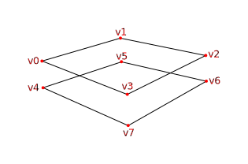

# 深度缓冲区

## 介绍

尽管目前我们的几何体都是投影到3D场景的,可是它仍然是扁平的。在本章我们会为位置增加一个Z轴，以实现3D网格。将会看到若没有经过深度排序,正方形的在定位会产生的问题。

## 3D几何体

修改 Vertex 结构体为位置使用3D向量,同时更新 VkVertexInputAttributeDescription 中的格式说明:

```C++
struct Vertex{
    glm::vec3 pos;
    glm::vec3 color;
    glm::vec2 texCoord;

    ...

    static std::array<VkVertexInputAttributeDescription, 3> getAttributeDescriptions() {
        std::array<VkVertexInputAttributeDescription, 3> attributeDescriptions{};

        attributeDescriptions[0].binding = 0;
        attributeDescriptions[0].location = 0;
        attributeDescriptions[0].format = VK_FORMAT_R32G32B32_SFLOAT;
        attributeDescriptions[0].offset = offsetof(Vertex, pos);

        ...
    }
};
```

下一步是更新顶点着色器的数据接收,3D坐标的转换,不要忘记重新编译着色器。

```glsl
layout(location = 0) in vec3 inPosition;

...

void main(){
    gl_Position = ubo.proj * ubo.view * ubo.model * vec4(inPosition, 1.0);
    fragColor = inColor;
    fragTexCoord = inTexCoord;
}
```

最后更新顶点容器，添加Z轴坐标:

```C++
const std::vector<Vertex> vertices = {
    {{-0.5f, -0.5f, 0.0f}, {1.0f, 0.0f, 0.0f}, {0.0f, 0.0f}},
    {{0.5f, -0.5f, 0.0f}, {0.0f, 1.0f, 0.0f}, {1.0f, 0.0f}},
    {{0.5f, 0.5f, 0.0f}, {0.0f, 0.0f, 1.0f}, {1.0f, 1.0f}},
    {{-0.5f, 0.5f, 0.0f}, {1.0f, 1.0f, 1.0f}, {0.0f, 1.0f}}
};
```

如果现在运行程序将会看到与之前一样的结果,现在是时候去添加一些新的几何体，让场景更加的有趣了,同时也是为了展示本章的主题。像下图那样去定义一些重复的顶点来表示位置:



使用Z轴坐标为-0.5,并为这个正方形添加类似的索引:

```C++
const std::vector<Vertex> vertices = {
    {{-0.5f, -0.5f, 0.0f}, {1.0f, 0.0f, 0.0f}, {0.0f, 0.0f}},
    {{0.5f, -0.5f, 0.0f}, {0.0f, 1.0f, 0.0f}, {1.0f, 0.0f}},
    {{0.5f, 0.5f, 0.0f}, {0.0f, 0.0f, 1.0f}, {1.0f, 1.0f}},
    {{-0.5f, 0.5f, 0.0f}, {1.0f, 1.0f, 1.0f}, {0.0f, 1.0f}},

    {{-0.5f, -0.5f, -0.5f}, {1.0f, 0.0f, 0.0f}, {0.0f, 0.0f}},
    {{0.5f, -0.5f, -0.5f}, {0.0f, 1.0f, 0.0f}, {1.0f, 0.0f}},
    {{0.5f, 0.5f, -0.5f}, {0.0f, 0.0f, 1.0f}, {1.0f, 1.0f}},
    {{-0.5f, 0.5f, -0.5f}, {1.0f, 1.0f, 1.0f}, {0.0f, 1.0f}}
};

const std::vector<uint16_t> indices = {
    0, 1, 2, 2, 3, 0,
    4, 5, 6, 6, 7, 4
};
```

运行程序，将会看到如下图像:


底部的正方形绘制在了上部正方形的上面,这是因为底部索引数组提供的更晚,有两种方案去解决这个问题:

- 以深度为标准由后向前排序所有绘制调用
- 使用深度缓冲区的深度测试

第一个方案通常被用于绘制有透明度的物体,但是更常用的解决片段顺序的方式是去使用深度缓冲,一个深度缓冲是附加的存储一个像素点的深度的数据区域,就像是颜色缓冲区存储着每一个点的颜色一样,每次光栅器都会生成一个片段,深度测试会检查新的深度是否比之前的深度更小,如果没有，这个新的片段会被丢弃掉,如果想法通过了深度测试，会将这个片段的新的深度值写入深度缓冲区,有可能手动操作修改这个值，就像手动控制颜色的输出一样。

```C++
#define GLM_FORCE_RADIANS
#define GLM_FORCE_DEPTH_ZERO_TO_ONE
#include <glm/glm.hpp>
#include <glm/gtc/matrix_transform.hpp>
```

GLM 库提供的透视投影深度范围是OpenGL中使用的默认为 -1.0 ~ 1.0范围, 我们这里需要使用 GLM_FORCE_DEPTH_ZERO_TO_ONE 来配置为 Vulkan 的范围 0.0 ~ 1.0 。

## 深度图像和视图

与颜色附件一样,深度附件也是基于图像的.不同点是，交换链并不会自动为我们创建深度附件,我们只需要单个的深度附件,因为一个绘制操作每时每刻都只会运行一次,深度缓冲会再次需要资源三件套 图像，内存和图像视图。

```C++
VkImage depthImage;
VkImageView depthImageView;
VkDeviceMemory depthImageMemory;
```

新建函数 createDepthResources 去创建这些资源:

```C++
void initVulkan() {
    ...
    createCommandPool();
    createDepthResources();
    createTextureImage();
    ...
}

...

void createDepthResources() {

}
```


## 渲染通道

## 帧缓冲

## 清理值

## 深度和模板状态

## 窗口大小修改
