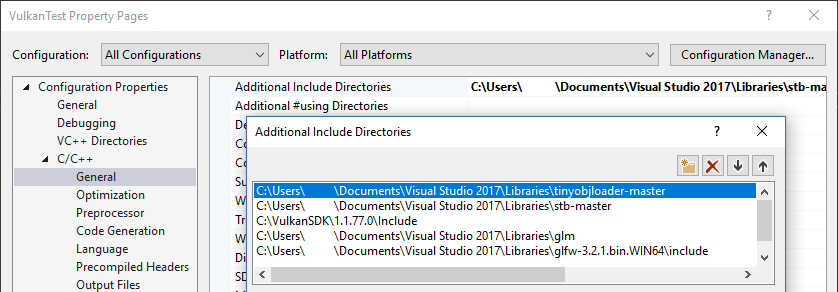

# 载入模型

## 介绍

你的程序现在已经可以去渲染3D网格了,但是目前的几何体数据还不是很有趣,本章我们会扩展程序让它能从模型文件中载入顶点和索引，从而让显卡真正去做一些事情。

很多3D API的教程都会教大家去实现一个自己的obj格式文件加载器,但问题是，很快就会遇到这种格式所不能支持的特性,例如骨骼动画,我们将在本章载入一个OBJ格式的文件,但我们会把精力放在程序集成网格数据本身,而不是读取文件的细节上面。

## 库

我们会使用 [tinyobjloader](https://github.com/tinyobjloader/tinyobjloader) 去实现读取obj文件载入顶点和面数据,它速度很快且易于集成，因为它与stb_image一样是一个单头文件库,进入这个仓库的链接下载 tiny_obj_loader.h ，将其拷贝到你的库目录中

#### Visual Studio

将 tiny_obj_loader.h 文件添加到 Additional Include Directories 配置中



#### Makefile

为 GCC 增加 tiny_obj_loader.h 的路径到 include 目录

```shell
VULKAN_SDK_PATH = /home/user/VulkanSDK/x.x.x.x/x86_64
STB_INCLUDE_PATH = /home/user/libraries/stb
TINYOBJ_INCLUDE_PATH = /home/user/libraries/tinyobjloader

...

CFLAGS = -std=c++17 -I$(VULKAN_SDK_PATH)/include -I$(STB_INCLUDE_PATH) -I$(TINYOBJ_INCLUDE_PATH)
```

## 示例网格

本章我们还没有使用到光照，所以使用一张已经烘培了光照效果的贴图作为纹理.

我调整了模型的大小和方向以便于使用它来代替当前的几何图形。

- [viking_room.obj](https://vulkan-tutorial.com/resources/viking_room.obj)
- [viking_room.png](https://vulkan-tutorial.com/resources/viking_room.png)

也可以使用自己的模型，但是需要保证它只使用了一种材质,且尺寸约为 1.5 x 1.5 x 1.5,如果大于这个值，就需要调整视图矩阵了,新建一个model 文件夹存放模型文件,将纹理图片也拷贝到 texture 文件夹中。

新建两个配置常量分别定义着模型和纹理的路径:

```C++
const uint32_t WIDTH = 800;
const uint32_t HEIGHT = 600;

const std::string MODEL_PATH = "models/viking_room.obj";
const std::string TEXTURE_PATH = "textures/viking_room.png";
```

更新 createTextureImage 函数使用新的纹理文件。

```C++
stbi_uc* pixels = stbi_load(TEXTURE_PATH.c_str(), &texWidth, &texHeight, &texChannels, STBI_rgb_alpha);
```

## 载入顶点与索引

我们现在准备从模型文件中载入顶点与索引了,所以现在可以移除全局的 vertices 和 indices 变量了,使用非常量的容器类型来给予替代。

```C++
std::vector<Vertex> vertices;
std::vector<uint32_t> indices;

VkBuffer vertexBuffer;
VkDeviceMemory vertexBufferMemory;
```

需要将索引的类型由 uint16_t 修改为 uint32_t 类型,因为模型中顶点的数量已经超过了65535,记住也需要修改 vkCmdBindIndexBuffer 的参数

```C++
vkCmdBindIndexBuffer(commandBuffer, indexBuffer , 0 , VK_INDEX_TYPE_UINT32);
```

tinyobjloader 使用方法与 stb_image 一样，包含 tiny_obj_loader.h 头文件，并在其中一个源文件中定义宏 TINYOBJLOADER_IMPLEMENTATION ,从而避免编译器报链接错误。

```C++
#define TINYOBJLOADER_IMPLEMENTATION
#include <tiny_obj_loader.h>
```

现在去实现一个 loadModel 函数，使用这个库去填充 vertices 和 indices 容器,它应该在 顶点 和 索引缓冲区建立前被调用:

```C++
void initVulkan() {
    ...
    loadModel();
    createVertexBuffer();
    createIndexBuffer();
    ...
}

...

void loadModel() {

}
```

通过调用函数 tinyobj::LoadObj 去载入模型的数据:

```C++
void loadModel(){
    tinyobj::arrtrib_t attrib;
    std::vector<tinyobj::shape_t> shapes;
    std::vector<tinyobj::material_t> materials;

    std::string warn, err;

    if(!tinyobj::LoadObj(&attrib, &shapes, &materials, &warn, &err, MODEL_PATH.c_str())) {
        throw std::runtime_error(warn + err);
    }
}
```

一个OBJ文件由 位置,法线,纹理坐标和面片组成,面片由数量可变的顶带你组成,每一个顶点会引用位置，法线，纹理坐标数据的索引,所以不仅可以重用顶点，也可以重用属性。

attrib 容器用于接收所有的位置,法线和纹理坐标，分别放入 attrib.vertices,attrib.normal,attrib.texcoords . shapes容器则包含了所有的独立物体及它们的面片,每一个面片由一个顶点数组组成,每一个顶点包含了位置，法线及纹理坐标的索引,OBJ模型也可以为每一个面片定义材质和纹理，但是这里我们选择忽略它。

err,warn 包含了在解析模型文件中产生的错误及警告信息,例如缺少材质定义,若 loadObj 函数返回错误则导入失败,正如前面所提到的,OBJ文件中的面片数据会包含可变数量的顶点数据,但是我们的应用程序只可以渲染三角形，幸运的是 LoadObj 有一个可变的参数会自动将面片三角化，这个参数是默认打开的。

我们准备将所有的面片都合并到一个模型中去,所以仅需要迭代所有的shapes :

```C++
for(const auto &shape : shapes){

}
```

三角化的特性保证了一个面片都会有三个顶点,所以现在我们可以直接迭代所有的顶点直接将它们汇聚到容器 vertices 中:

```C++
for (const auto& shape : shapes) {
    for (const auto& index : shape.mesh.indices) {
        Vertex vertex{};

        vertices.push_back(vertex);
        indices.push_back(indices.size());
    }
}
```

为了简单起见,我们假定每一个顶点都是唯一的,因此简单的自增长这个索引值,index 变量的类型是 tinyobj::index_t,其包含有 vertex_index、normal_index 和 texcoord_index 成员变量,我们需要使用这些索引值去找到真正的顶点属性.

```C++
vertex.pos = {
    attrib.vertices[3 * index.vertex_index + 0],
    attrib.vertices[3 * index.vertex_index + 1],
    attrib.vertices[3 * index.vertex_index + 2]
};

vertex.texCoord = {
    attrib.texcoords[2 * index.texcoord_index + 0],
    attrib.texcoords[2 * index.texcoord_index + 1]
};

vertex.color = {1.0f, 1.0f, 1.0f};
```

不幸的是 attrib.vertices 顶点数组是一个一维的 float 数组,而不是类似 glm::vec3 类型的数组,因此我们需要将 index 值乘以3,与之相似的,纹理和法线坐标也需要分别乘上2和3.

现在使用优化后的编译选项运行你的程序,这是有必要的，因为载入模型会很慢,然后会看到如下的画面:


很好，集合形状看起来是正确的,可是纹理怎么变成这样了呢？OBJ格式的纹理坐标是假定使用了 0 表示图片最底部的坐标系统的，然而,我们上传给Vulkan的图像是一个从顶部到底部的坐标系,这意味着0代表着图像的顶部,为了解决这个问题，需要将垂直的坐标系进行一次翻转。

```C++
vertex.texCoord = {
    attrib.texcoords[2 * index.texcoord_index + 0],
    1.0f - attrib.texcoords[2 * index.texcoord_index + 1]
};
```

现在再次运行程序，就可以看到正确的结果了:


所有辛苦的工作现在似乎都获得了回报.

> 随着模型的旋转，也许你注意到了模型的背面看起来有一些奇怪,这是正常的因为模型并没真正被设计成背部可见。

## 顶点去重

不幸的是我们并没有真正利用上索引缓冲区的优势,verteics容器中包含了大量的重复顶点数据,因为许多顶点都被三角形重复包含了,我们应该保证顶点数据仅有一份，使用索引数据来重用它们,一个较为直接的方法是使用 map 或者 unordered_map 来追踪唯一顶点,并用索引来代替它：

```C++
#include <unordered_map>

...

std::unordered_map<Vertex, uint32_t> uniqueVertices{};

for(const auto &shape : shapes){
    for (const auto& index : shape.mesh.indices) {
        Vertex vertex{};

        ...

        if (uniqueVertices.count(vertex) == 0) {
            uniqueVertices[vertex] = static_cast<uint32_t>(vertices.size());
            vertices.push_back(vertex);
        }

        indices.push_back(uniqueVertices[vertex]);
    }
}//end for each
```

每一次我们从OBJ文件中读取一个顶点数据的时候,我们都会检查是否此顶点有相同的位置和纹理坐标,如果没有，我们会将它加入vertices并且将索引记入uniqueVertices 中,在这之后，我们为新的顶点添加一个索引,如果已经存在相同的顶点,会找到它在 uniqueVertices中的索引存入 indices 中.

此段程序如果现在编译会报错,因为 Vertex 结构体是一个用户自定义的类型,我们需要再提供两个函数的实现:相等测试 和 哈希计算,前者通过复写 == 操作符重载很容易实现:

```C++
bool operator==(const Vertex &other) const{
    return pos == other.pos && color == other.color && texCoord == other.texCoord;
}
```

结构体 Vertex 哈希函数的实现可以通过实现一个std::hash<T>的模板来实现,哈希函数是一个较为复杂的主题,标准委员会建议采用将结构体组合的方式实现一个较为不错的哈希函数：

```C++
namespace std{
    template<> struct hash<Vertex>{
        size_t operator()(Vertex const &vertex) const {
            return ((hash<glm::vec3>()(vertex.pos) ^
                   (hash<glm::vec3>()(vertex.color) << 1)) >> 1) ^
                   (hash<glm::vec2>()(vertex.texCoord) << 1);
        }
    }
}
```

此段代码需要放在 Vertex 结构体的外面,GLM库使用哈希函数需要包含以下的头文件:

```C++
#define GLM_ENABLE_EXPERIMENTAL
#include <glm/gtx/hash.hpp>
```

此哈希函数定义在 gtx 文件夹下,这意味着它仍然是一个GLM库的实验性扩展,因此需要定义宏 GLM_ENABLE_EXPERIMENTAL 才能使用它,同时也意味着未来此功能可能会被改变，不过目前教程中它是稳定的。

你现在应该可以成功的编译和运行程序了,如果现在检查 vertices 容器的大小,会看到数量从 1,500,000 下降到了 265,645! 这表示每一个顶点都大约会被6个三角形所重用,这会为我们节省下大量的显存空间。

[C++ code](code/28_model_loading.cpp) / [Vertex shader](code/27_shader_depth.vert) / [Fragment shader](code/27_shader_depth.frag)
